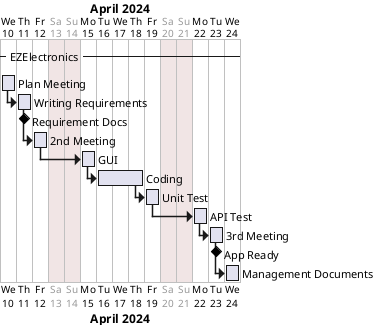

# Project Estimation - CURRENT
Date: 02-05-2024

Version: V1

# Estimation approach
Consider the EZElectronics  project in CURRENT version (as given by the teachers), assume that you are going to develop the project INDEPENDENT of the deadlines of the course, and from scratch
# Estimate by size
### 
|             | Estimate                        |             
| ----------- | ------------------------------- |  
| NC =  Estimated number of classes to be developed   |     5                          |             
|  A = Estimated average size per class, in LOC       |  100                          | 
| S = Estimated size of project, in LOC (= NC * A) |500 |
| E = Estimated effort, in person hours (here use productivity 10 LOC per person hour)  | 50                                    |   
| C = Estimated cost, in euro (here use 1 person hour cost = 30 euro) |1500 | 
| Estimated calendar time, in calendar weeks (Assume team of 4 people, 8 hours per day, 5 days per week ) |   2 days and half, Half a week                 |               

# Estimate by product decomposition
### 
|         component name    | Estimated effort (person hours)   |             
| ----------- | ------------------------------- | 
|requirement document    | 8 |
| GUI prototype |5|
|design document |16|
|code |50|
| unit tests |10|
| api tests |5|
| management documents  |10|

# Estimate by activity decomposition
### 
|         Activity name    | Estimated effort (person hours)   |             
| -------------- |----------| 
| Plan Meeting   |    2      |
|Writing requirements |  19  |
|2nd Meeting     |   2       |
|  GUI         |    5    |
|   coding         |  70        |
|Unit Test       |     5     |
|API Test        |     5     |
|3rd Meeting     |     2     |
|Management Documents|  5    |

###

# Summary

The estimate is different depending on the different approaches used. This difference could be explained by the fact that the estimate by size approach does not take into account the preliminary work but rather the efforts made in the coding phase. It is therefore the least precise approach to estimate the effort unlike the estimate by activity decomposition one.

|             | Estimated effort                        |   Estimated duration |          
| ----------- | ------------------------------- | ---------------|
| estimate by size |50|Half a week
| estimate by product decomposition |104|4 days
| estimate by activity decomposition |115|4 days

