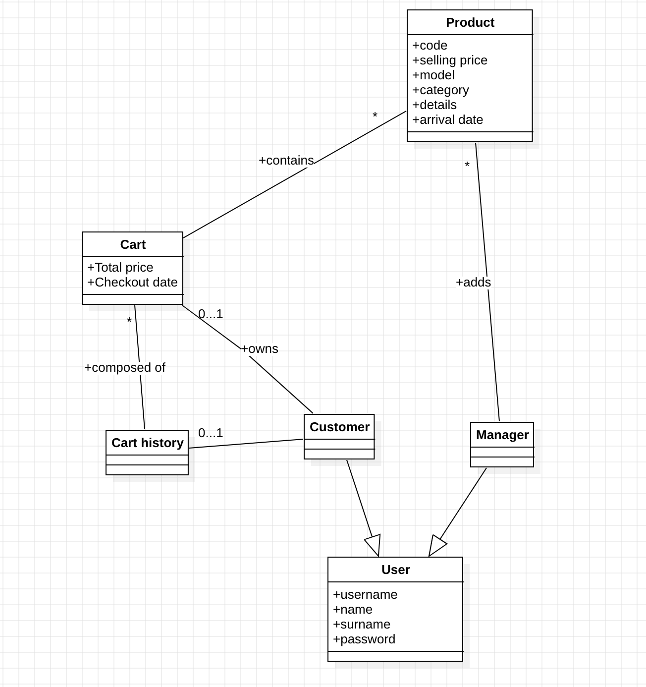
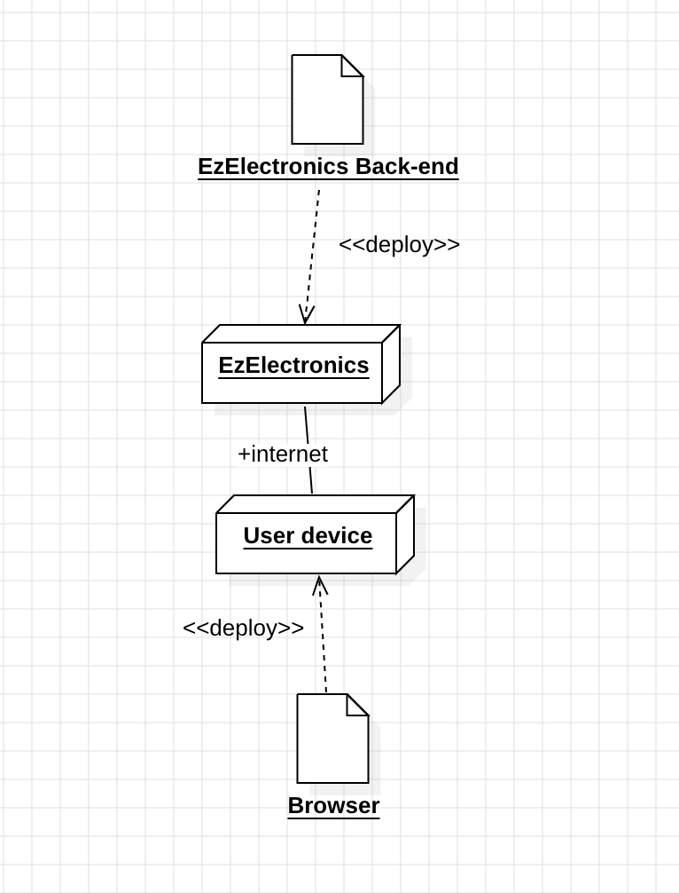

# Requirements Document - current EZElectronics

Date:

Version: V1.5 - description of EZElectronics in CURRENT form (as received by teachers)

| Version number | Change |
| :------------: | :----: |
|  1.1           | Functional Requirements and Stakeholders added.       |
|  1.2           | Stories and Personas and Non Functional Requirements added.       |
|  1.3           | Context Diagram and Interfaces added.       |
|  1.4           | Use case diagram and use cases added.       |
|  1.5           | Glossary and deployment diagram added.       |

# Contents

- [Requirements Document - current EZElectronics](#requirements-document---current-ezelectronics)
- [Contents](#contents)
- [Informal description](#informal-description)
- [Stakeholders](#stakeholders)
- [Context Diagram and interfaces](#context-diagram-and-interfaces)
  - [Context Diagram](#context-diagram)
  - [Interfaces](#interfaces)
- [Stories and personas](#stories-and-personas)
- [Functional and non functional requirements](#functional-and-non-functional-requirements)
  - [Functional Requirements](#functional-requirements)
  - [Non Functional Requirements](#non-functional-requirements)
- [Use case diagram and use cases](#use-case-diagram-and-use-cases)
  - [Use case diagram](#use-case-diagram)
    - [Use case 1, UC1](#use-case-1-uc1)
      - [Scenario 1.1](#scenario-11)
      - [Scenario 1.2](#scenario-12)
      - [Scenario 1.x](#scenario-1x)
    - [Use case 2, UC2](#use-case-2-uc2)
    - [Use case x, UCx](#use-case-x-ucx)
- [Glossary](#glossary)
- [System Design](#system-design)
- [Deployment Diagram](#deployment-diagram)

# Informal description

EZElectronics (read EaSy Electronics) is a software application designed to help managers of electronics stores to manage their products and offer them to customers through a dedicated website. Managers can assess the available products, record new ones, and confirm purchases. Customers can see available products, add them to a cart and see the history of their past purchases.

# Stakeholders

| Stakeholder name | Description |
| :--------------: | :---------: |
| Stakeholder x..  |             |

# Context Diagram and interfaces

## Context Diagram

## Interfaces

|   Actor   | Logical Interface | Physical Interface |
| :-------: | :---------------: | :----------------: 
|Customer  | GUI(to be defined - key function, create a personal account, show stores and their products, purchases)  |    Smartphone or PC      |
|Manager  | GUI (to be defined - interface for view, add products and control usr,manage payments)|    smartphone or PC    |

# Stories and personas

### Persona 1:
Maria, female, 35 years old, store manager of an electronic store
Story: Maria aims to streamline the process of managing her store’s product and making them available online for customers

### Persona 2:
John, male, 40 years old, manager of multiple stores
Story: John manages multiple electronic stores across the city and needs a centralized system to oversee all the stores

### Persona 3:
Anita, 25 years old, customer
Story: Anita is a regular customer of an electronic store and prefers to shop online from her smartphone due to her busy schedule

# Functional and non functional requirements

## Functional Requirements

|  ID       | Description |
| :---:     | :---------: |
|  FR1      | Manage Users |
|  FR1.1    | Add User (Unclear who can add an user and in what context, as no authentication is required to call UserRoutes.router.post, and both manager and customer users can be crated) |
|  FR2      | Manage Products |
|  FR2.1    | Register new products |
|  FR2.2    | Register the arrival of a set of previously registered products |
|  FR2.3    | Register the sale of a product |
|  FR2.4    | Show a list of products |
|  FR2.4.1  | This list can be filtered by: sold/not sold, a specific product, a specific category |
|  FR2.5    | Delete a product |
|  FR3      | Manage Carts |
|  FR3.1    | Add a product to its own cart |
|  FR3.1.1  | A product can not be added to a cart cart twice |
|  FR3.1.2  | A product can not be added to the cart if it is sold out |
|  FR3.2    | Remove a product from it’s own cart |
|  FR3.2.1  | Products can not be removed from the cart if it has already been paid for |
|  FR3.3    | Check out the cart |
|  FR3.4    | Customer can see it’s own cart history from last purchases |
|  FR3.4.1  | Only previous carts that have been paid for can be found |
|  FR4      | Authorization and Authentication |
|  FR4.1    | Log in and Log out |
|  FR4.2    | Allow customer functionalities only for logged in customer |
|  FR4.2.1  | Customer functionalities are the ones described in FR3.X |
|  FR4.3    | Allow manager functionalities only for logged in managers |
| FR4.3.1   | Manager functionalities are the ones are described in FR2.X |

## Non Functional Requirements

|   ID    | Type | Description | Refers to |
| :-----: | :--------------------------------: | :---------: | :-------: |
|  NFR1   |    Usability                                |      Web application should be intuitive and user-friendly, requiring no specialized training for customers already familiar with e-commerce apps and websites. Managers should also find it straightforward to use it for different functions.       |    All FR       |
|  NFR2   |    Efficiency                                |      All functions on the app must be completed in < 0.1 s, excluding internet connection time       |  All FR         |
|  NFR3   |     Reliability                               |  No more than one defect per year per user, server must be online and operational 99% of the time      |    All FR       |
| NFR4 |    Security                              | Data security and sharing between users and stores must be handled securely and in compliance with privacy regulations.        |    FR4       |
| NFR5 |    Portability                              | Compatibility with most common browser (Chrome, Safari, Edge…)        |    All FR      |

# Use case diagram and use cases

## Use case diagram

### Use case 1, UC1 - Manage products

| Actors Involved  |                               User (Manager)                                       |
| :--------------: | :------------------------------------------------------------------: |
|   Precondition   | User is logged in as manager |
|  Post condition  | product registered/arrival date set for a set of products/product marked as sold/show list of products/product deleted   |
| Nominal Scenario |         Scenario 1.1, 1.2, 1.3, 1.4, 1.5     |
|     Variants     |                      None                   |
|    Exceptions    |                       1.6, 1.7, 1.8, 1.9            |

##### Scenario 1.1

|  Scenario 1.1  |                                       Register a product                               |
| :------------: | :------------------------------------------------------------------------: |
|  Precondition  | User logged in as manager |
| Post condition |  Product registered   |
|     Step#      |                                Description                                 |
|       1        |    User: ask to register a new product                                                              |
|       2        |    System: ask code, selling price, model, category, details, arrival date                                                      |
|      3      |   User: provide code, selling price, model, category, details, arrival date                                             |
|      4      |   System: check that the provided code is not present in the db, product registered                                      |
|      5      |   System: show a success message                                        |

##### Scenario 1.2

|  Scenario 1.2  |                                       Set arrival date for a set of products                                  |
| :------------: | :------------------------------------------------------------------------: |
|  Precondition  | User logged in as manager |
| Post condition |  Arrival date set   |
|     Step#      |                                Description                                 |
|       1        |    User: ask to set arrival date for a set of products of the same model                                                            |
|       2        |    System: ask model, category, details, quantity, arrival date, selling price                                                      |
|      3      |   User: provide model, category, details, quantity, arrival date, selling price                                    |
|      4      |   System: check that the provided date is not after the current date, provided date is not after current date, arrival date set for the set of products                                |

##### Scenario 1.3

|  Scenario 1.3  |                                       Mark product as sold                                   |
| :------------: | :------------------------------------------------------------------------: |
|  Precondition  | User logged in as manager |
| Post condition |  Product marked as sold   |
|     Step#      |                                Description                                 |
|       1        |    User: ask to mark a product as sold                                                        |
|       2        |    System: ask the code of the product and the selling date                                                     |
|      3      |   User: provide the code of the product and the selling date                                   |
|      4      |   System: check that the provided code is present in the db, the code is already present                            |
|      5      |   System: check that the provided selling date is not after the current date, selling date is not after the current date        |
|      6      |   System: check that the selling date is after the arrival date, selling date is after the arrival date        |
|      7      |   System: retrieve the selling date of the product given the code, check if selling date is already present, selling date is not present, selling date for the product is updated        |

##### Scenario 1.4

|  Scenario 1.4  |                                       Show list of products                                 |
| :------------: | :------------------------------------------------------------------------: |
|  Precondition  | User logged in as manager |
| Post condition |  List of products shown   |
|     Step#      |                                Description                                 |
|       1        |    User: ask list of products, with the option to use filters                                                        |
|       2        |    System: retrieve products and show them                                                     |

##### Scenario 1.5

|  Scenario 1.5  |                                       Delete a product                                |
| :------------: | :------------------------------------------------------------------------: |
|  Precondition  | User logged in as manager |
| Post condition |  Product deleted   |
|     Step#      |                                Description                                 |
|       1        |    User: ask to delete a product                                                              |
|       2        |    System: ask the product code                                                     |
|      3      |   User: provide the product code                                           |
|      4      |   System: check that the provided code is present in the db, code already present, product deleted                                     |
##### Scenario 1.6

|  Scenario 1.6  |                                       Duplicate code for a product    (register a product)                               |
| :------------: | :------------------------------------------------------------------------: |
|  Precondition  | User logged in as manager |
| Post condition |  Product not registered   |
|     Step#      |                                Description                                 |
|       1        |    User: ask to register a new product                                                              |
|       2        |    System: ask code, selling price, model, category, details, arrival date                                                      |
|      3      |   User: provide code, selling price, model, category, details, arrival date                                             |
|      4      |   System: check that the provided code is not present in the db, code already present, product not registered                                      |
|      5      |   System: show an error message                                        |

##### Scenario 1.7

|  Scenario 1.7  |                                       Arrival date after current date                                   |
| :------------: | :------------------------------------------------------------------------: |
|  Precondition  | User logged in as manager |
| Post condition |  Arrival date not set   |
|     Step#      |                                Description                                 |
|       1        |    User: ask to set arrival date for a set of products of the same model                                                            |
|       2        |    System: ask model, category, details, quantity, arrival date, selling price                                                      |
|      3      |   User: provide model, category, details, quantity, arrival date, selling price                                    |
|      4      |   System: check that the provided date is not after the current date, provided date is after the current date, arrival date not set for set the of products                                |
|      5      |   System: show an error message                             |

##### Scenario 1.8

|  Scenario 1.8  |                                       Mark product as sold (errors)                                  |
| :------------: | :------------------------------------------------------------------------: |
|  Precondition  | User logged in as manager |
| Post condition |  Product not marked as sold   |
|     Step#      |                                Description                                 |
|       1        |    User: ask to mark a product as sold                                                        |
|       2        |    System: ask the code of the product and the selling date                                                     |
|      3      |   User: provide the code of the product and the selling date                                   |
|      4      |   System: run checks. The code is not present in the db OR selling date is after the current date OR selling date is before the arrival date OR selling date is already present in the db                     |
|      5      |   System: show an error message       |

##### Scenario 1.9

|  Scenario 1.9  |                                       Code is not present in the db (delete a product)                             |
| :------------: | :------------------------------------------------------------------------: |
|  Precondition  | User logged in as manager |
| Post condition |  Product not deleted   |
|     Step#      |                                Description                                 |
|       1        |    User: ask to delete a product                                                              |
|       2        |    System: ask the product code                                                     |
|      3      |   User: provide the product code                                           |
|      4      |   System: check that the provided code is in the db, code is not present, product is not deleted                                     |

### Use case 2, UC2 - Manage cart

| Actors Involved  |                               User (customer)                                      |
| :--------------: | :------------------------------------------------------------------: |
|   Precondition   | User is logged in as customer |
|  Post condition  |Product added/product removed/checkout/cart history shown  |
| Nominal Scenario |         Scenario 2.1, 2.2, 2.3, 2.4     |
|     Variants     |                      None                   |
|    Exceptions    |                       Scenario 2.5, 2.6, 2.7, 2.8            |

##### Scenario 2.1

|  Scenario 2.1  |                                       Add a product to the current cart of a logged in user                             |
| :------------: | :------------------------------------------------------------------------: |
|  Precondition  | User logged in as customer |
| Post condition |  Product added   |
|     Step#      |                                Description                                 |
|       1        |    User: ask to add a product to the cart by product code                                                            |
|       2        |    System: check if the product exists in the db given the product code, the product exists                                                |
|      3      |   System: check if the product code is already present in another cart,the product is only in one cart                                      |
|      4      |   System: check the availability of the product, the product is available, the product is added to the cart                                  |
##### Scenario 2.2

|  Scenario 2.2  |                                       Remove a product from the current cart of a logged in user                            |
| :------------: | :------------------------------------------------------------------------: |
|  Precondition  | User logged in as customer |
| Post condition |  Product removed   |
|     Step#      |                                Description                                 |
|       1        |    User: ask to remove a product to the cart by product code                                                            |
|       2        |    System: check if the product exists is present in the cart, the product is present in the cart                                                |
|       3        |    System: check if the logged in user has a cart, the user has a cart                                               |
|       4        |    System: check if the product exists in the db given the product code, the product exists                                                |
|      5     |   System: check the availability of the product, the product is available, the product is removed from the cart                                  |

##### Scenario 2.3

|  Scenario 2.3  |                                       Checkout the cart                          |
| :------------: | :------------------------------------------------------------------------: |
|  Precondition  | User logged in as customer |
| Post condition |  Cart checked out   |
|     Step#      |                                Description                                 |
|       1        |    User: ask to checkout the current cart                                                        |
|       2        |    System: check if the user has a cart, the user has a cart                                              |
|      3      |   System: check if cart is empty, the cart is not empty                                      |
|      4      |   System: set the total of cart as the sum of the costs of all products, set payment date as the current date                               |

##### Scenario 2.4

|  Scenario 2.4  |                                       Show history of the carts                         |
| :------------: | :------------------------------------------------------------------------: |
|  Precondition  | User logged in as customer |
| Post condition |  History of carts shown   |
|     Step#      |                                Description                                 |
|       1        |    User: ask to see the history of carts                                                        |
|       2        |    System: show the history of carts for the user                                              |
##### Scenario 2.5

|  Scenario 2.5  |                                       Product is not added to the cart                          |
| :------------: | :------------------------------------------------------------------------: |
|  Precondition  | User logged in as customer |
| Post condition |  Product not added   |
|     Step#      |                                Description                                 |
|       1        |    User: ask to add a product to the cart by product code                                                            |
|       2        |    System: run checks. The product doesn't exist in the db OR the product is available in more than one cart OR the product is not available                                  |
|      3      |   System: show an error message                                     |

##### Scenario 2.6

|  Scenario 2.6  |                                       Product is not removed from the cart                            |
| :------------: | :------------------------------------------------------------------------: |
|  Precondition  | User logged in as customer |
| Post condition |  Product not removed   |
|     Step#      |                                Description                                 |
|       1        |    User: ask to remove a product to the cart by product code                                                            |
|       2        |    System: run checks. The product is not present in the cart OR the user doesn't have a cart OR the product doesn't exist in the db OR the product is not available                                              |
|      5     |   System: show an error message                                |

##### Scenario 2.7

|  Scenario 2.7  |                                       Cart not checked out (cart doesn't exist)                        |
| :------------: | :------------------------------------------------------------------------: |
|  Precondition  | User logged in as customer |
| Post condition |  Cart not checked out   |
|     Step#      |                                Description                                 |
|       1        |    User: ask to checkout the current cart                                                        |
|       2        |    System: check if the user has a cart, the user doesn't have a cart                                              |
|      3      |   System: show an error message|

##### Scenario 2.8

|  Scenario 2.8  |                                       Cart not checked out (empty cart)                         |
| :------------: | :------------------------------------------------------------------------: |
|  Precondition  | User logged in as customer |
| Post condition |  Cart not checked out   |
|     Step#      |                                Description                                 |
|       1        |    User: ask to checkout the current cart                                                        |
|       2        |    System: check if the user has a cart, the user has a cart                                              |
|      3      |   System: check if cart is empty, the cart is empty                                      |
|      4      |   System: show an error message                          |

### Use case 3, UC3 - Login

| Actors Involved  |                               User                                       |
| :--------------: | :------------------------------------------------------------------: |
|   Precondition   | User not logged in, user registered |
|  Post condition  | User logged in  |
| Nominal Scenario |         Scenario 3.1     |
|     Variants     |                      None                   |
|    Exceptions    |                       Scenario 3.2, 3.3, 3.4                   |

##### Scenario 3.1

|  Scenario 3.1  |                                       Login                                    |
| :------------: | :------------------------------------------------------------------------: |
|  Precondition  | User not logged in, user registered |
| Post condition |  User logged in   |
|     Step#      |                                Description                                 |
|       1        |    System: ask username, password                                                                   |
|       2        |    User: provide username, password                                                                  |
|      3      |   System: read username and password, check cookie, user is not logged in                                                                   |
|      4      |   System: retrieve password in db from username,compare passwords. Passwords match, user is logged in                                                                   |

##### Scenario 3.2

|  Scenario 3.2  |                                       Wrong password                                    |
| :------------: | :------------------------------------------------------------------------: |
|  Precondition  | User not logged in, user registered |
| Post condition |  User not logged in   |
|     Step#      |                                Description                                 |
|       1        |    System: ask username, password                                                                   |
|       2        |    User: provide username, password                                                                  |
|      3      |   System: read username and password, check cookie, user is not logged in                                                                   |
|      4      |   System: retrieve password in db from username,compare passwords. Passwords don't match, user is not logged in                                                                   |

##### Scenario 3.3

|  Scenario 3.3  |                                       User not registered                                   |
| :------------: | :------------------------------------------------------------------------: |
|  Precondition  | User not logged in, user not registered |
| Post condition |  User not registered  |
|     Step#      |                                Description                                 |
|       1        |    System: ask username, password                                                                   |
|       2        |    User: provide username, password                                                                  |
|      3      |   System: read username and password, check cookie, user is not logged in                                                                   |
|      4      |   System: given username retrieve user in db. User is not found, user is not authorized                                                               |

##### Scenario 3.4

|  Scenario 3.4  |                                       User already logged in                                   |
| :------------: | :------------------------------------------------------------------------: |
|  Precondition  | User not logged in, user registered |
| Post condition |  User logged in   |
|     Step#      |                                Description                                 |
|       1        |    System: ask username, password                                                                   |
|       2        |    User: provide username, password                                                                  |
|      3      |   System: read username and password, check cookie, user is already logged in                                                                   |
|      4      |   System: send an error message                                                               |

### Use case 4, UC4 - Logout

| Actors Involved  |                               User                                       |
| :--------------: | :------------------------------------------------------------------: |
|   Precondition   | User logged in |
|  Post condition  | User not logged in  |
| Nominal Scenario |         Scenario 4.1     |
|     Variants     |                      None                   |
|    Exceptions    |                       Scenario 4.2            |

##### Scenario 4.1

|  Scenario 4.1  |                                       Logout                                   |
| :------------: | :------------------------------------------------------------------------: |
|  Precondition  | User logged in |
| Post condition |  User not logged in   |
|     Step#      |                                Description                                 |
|       1        |    User: ask to logout                                                                |
|       2        |    System: retrieve user from username in the db, check cookie, the user is logged in                                                            |
|      3      |   System: remove authorization to the user device, show a logout message                                                   |
##### Scenario 4.2

|  Scenario 4.2  |                                       User already logged out                                   |
| :------------: | :------------------------------------------------------------------------: |
|  Precondition  | User not logged in |
| Post condition |  User not logged in   |
|     Step#      |                                Description                                 |
|       1        |    User: ask to logout                                                                |
|       2        |    System: retrieve user from username in the db, check cookie, the user is not logged in                                                            |
|      3      |   System: show an error message                                                   |

### Use case 5, UC5 - Registration

| Actors Involved  |                               User                                       |
| :--------------: | :------------------------------------------------------------------: |
|   Precondition   | User not registered |
|  Post condition  | User registered  |
| Nominal Scenario |         Scenario 5.1     |
|     Variants     |                      None                   |
|    Exceptions    |                       Scenario 5.2            |

##### Scenario 5.1

|  Scenario 5.1  |                                       Registration                                   |
| :------------: | :------------------------------------------------------------------------: |
|  Precondition  | User not registered |
| Post condition |  User registered   |
|     Step#      |                                Description                                 |
|       1        |    User: ask to register                                                                |
|       2        |    System: ask username, name, surname, password, role                                                            |
|      3      |   User: provide username, name, surname, password, role                                              |
|      4      |   System: check that the provided username isn't associated with any account yet. The username hasn't been used yet                                         |
|      5      |   System: create a new user, store his information                                        |

##### Scenario 5.2

|  Scenario 5.2  |                                       Registration                                   |
| :------------: | :------------------------------------------------------------------------: |
|  Precondition  | User registered |
| Post condition |  User not registered   |
|     Step#      |                                Description                                 |
|       1        |    User: ask to register                                                                |
|       2        |    System: ask username, name, surname, password, role                                                            |
|      3      |   User: provide username, name, surname, password, role                                              |
|      4      |   System: check that the provided username isn't associated with any account yet. The username has been already used                                         |
|      5      |   System: show an error message                                       |
### Use case 6, UC6 - Manage roles

| Actors Involved  |                               User                                       |
| :--------------: | :------------------------------------------------------------------: |
|   Precondition   | User is logged in as customer/manager |
|  Post condition  | Perform actions related to the role  |
| Nominal Scenario |         Scenario 6.1    |
|     Variants     |                      None                   |
|    Exceptions    |                       Scenario 6.2            |

##### Scenario 6.1

|  Scenario 6.2  |                                       Perform action                        |
| :------------: | :------------------------------------------------------------------------: |
|  Precondition  | User logged in as customer/manager |
| Post condition |  Action performed   |
Step#      |                                Description                                 |
|       1        |    User: ask to perform action                                                     |
|       2        |    System: check if role of the user, the role of the user is correct, perform action                                            |
##### Scenario 6.2
|  Scenario 6.2  |                                       Action not performed (user not authorized)                            |
| :------------: | :------------------------------------------------------------------------: |
|  Precondition  | User logged in as customer/manager |
| Post condition |  Action  not performed   |
Step#      |                                Description                                 |
|       1        |    User: ask to perform action                                                     |
|       2        |    System: check if role of the user, the role of the user is not correct                                        |
|       3        |    System: show an error message                                      |

# Glossary

# System Design

# Deployment Diagram

