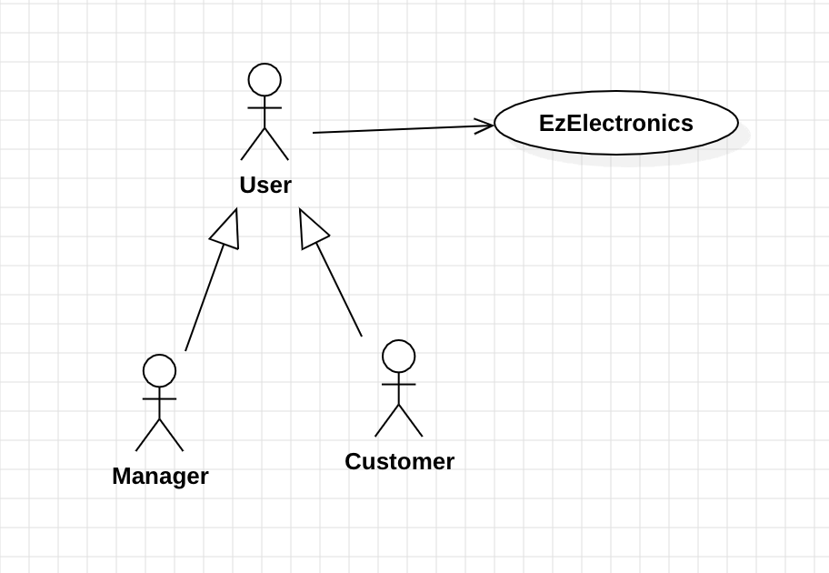
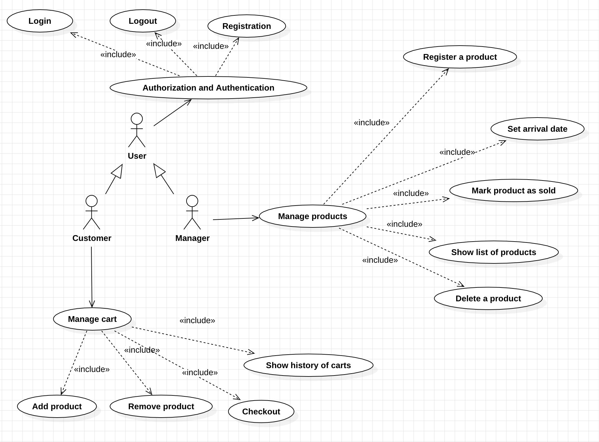
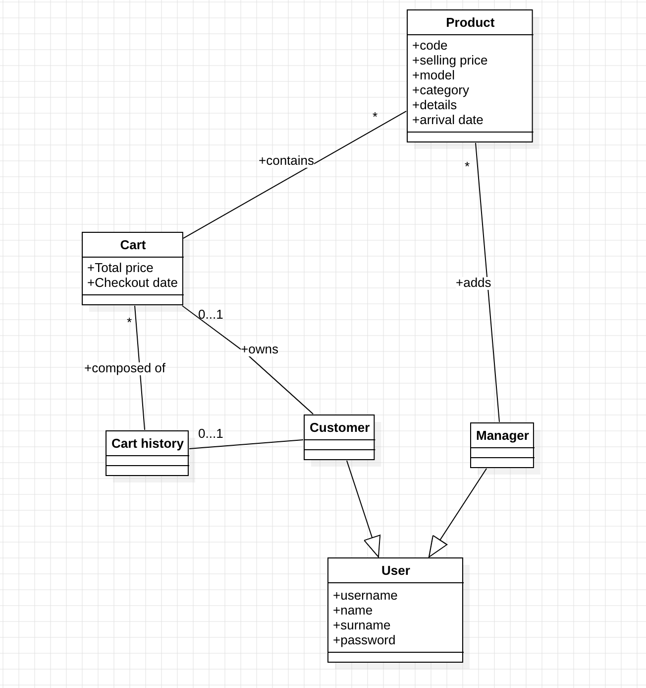
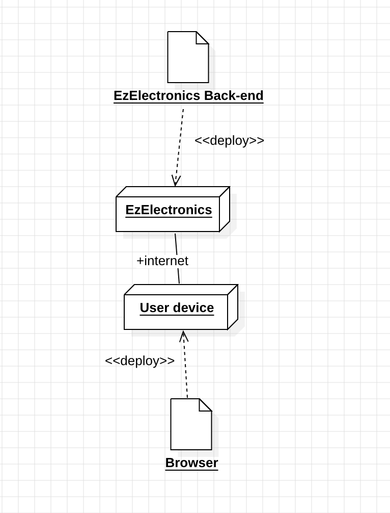

# Requirements Document - current EZElectronics

Date:30/04/2024

Version: V2.6

| Version number | Change |
| :------------: | :----: |
|  1.1           | Functional Requirements and Stakeholders added.            |
|  1.2           | Stories and Personas and Non Functional Requirements added.|
|  1.3           | Context Diagram and Interfaces added.                      |
|  1.4           | Use case diagram and use cases added.                      |
|  1.5           | Glossary and deployment diagram added.                     |
|  2.1           | Payment API added                                          |
|  2.2           | Administrator role added                                   |
|  2.3           | Products are associated with an image                      |
|  2.4           | Managers can search for carts                              |
|  2.5           | Return Faulty Produscts functionality added                |
|  2.6           | Ratings and Reviews for products added                     |

# Contents

- [Requirements Document - current EZElectronics](#requirements-document---current-ezelectronics)
- [Contents](#contents)
- [Informal description](#informal-description)
- [Stakeholders](#stakeholders)
- [Context Diagram and interfaces](#context-diagram-and-interfaces)
  - [Context Diagram](#context-diagram)
  - [Interfaces](#interfaces)
- [Stories and personas](#stories-and-personas)
- [Functional and non functional requirements](#functional-and-non-functional-requirements)
  - [Functional Requirements](#functional-requirements)
  - [Non Functional Requirements](#non-functional-requirements)
- [Use case diagram and use cases](#use-case-diagram-and-use-cases)
  - [Use case diagram](#use-case-diagram)
    - [Use case 1, UC1](#use-case-1-uc1)
      - [Scenario 1.1](#scenario-11)
      - [Scenario 1.2](#scenario-12)
      - [Scenario 1.x](#scenario-1x)
    - [Use case 2, UC2](#use-case-2-uc2)
    - [Use case x, UCx](#use-case-x-ucx)
- [Glossary](#glossary)
- [System Design](#system-design)
- [Deployment Diagram](#deployment-diagram)

# Informal description

EZElectronics (read EaSy Electronics) is a software application designed to help managers of electronics stores to manage their products and offer them to customers through a dedicated website. Managers can assess the available products, record new ones, confirm purchases, search for carts and exchange faulty products. Customers can see available products, add them to a cart, see the history of their past purchases, checkout their cart and decide whether to pay online or at pickup in the store and give reviews to products. 

# Stakeholders

| Stakeholder name | Description |
| :--------------: | :---------: |
| Customer         | Application user that intends on buying from the store by selecting the products, adding them to the cart and checkout the cart.|
| Manager          | Application user responsible for managing the state of the App (list of products, product availability) and registering the sales in the app. |
| Seller at Point Of Sale (POS)| Person responsible for managing the sale at the POS, by handing the bought items to the customer and receiving the payment. Can also be the manager, but not necessarily. |
| Store Owner      | Owner of the electronics store who purchases the EZElectronics software in order to have a dedicated website facilitating its sales.|
| Administrator    | Responsible for maintaining the application and authorizing the creation of Manager profiles     |

# Context Diagram and interfaces

## Context Diagram

## Interfaces

|   Actor   | Logical Interface | Physical Interface |
| :-------: | :---------------: | :----------------: 
|Customer     | GUI (key function, create a personal account, show stores and their products, purchases)  | Smartphone or PC|
|Manager      | GUI (interface for view, add products and control usr,manage payments)                    | Smartphone or PC|
|Administrator| Command Line Interface                                                                    | PC              |

# Stories and personas

### Persona 1:
Maria, female, 35 years old, store manager of an electronic store
Story: Maria aims to streamline the process of managing her store’s product and making them available online for customers

### Persona 2:
John, male, 40 years old, manager of multiple stores
Story: John manages multiple electronic stores across the city and needs a centralized system to oversee all the stores

### Persona 3:
Anita, 25 years old, customer
Story: Anita is a regular customer of an electronic store and prefers to shop online from her smartphone due to her busy schedule

# Functional and non functional requirements

## Functional Requirements

|  ID       | Description |
| :---:     | :---------: |
|  FR1      | Manage Users |
|  FR1.1    | Add User (Unclear who can add an user and in what context, as no authentication is required to call UserRoutes.router.post, and both manager and customer users can be crated) |
|  FR2      | Manage Products |
|  FR2.1    | Register new products |
|  FR2.2    | Register the arrival of a set of previously registered products |
|  FR2.3    | Register the sale of a product |
|  FR2.4    | Show a list of products |
|  FR2.4.1  | This list can be filtered by: sold/not sold, a specific product, a specific category |
|  FR2.5    | Delete a product |
|  FR2.6    | Register the exchange of a faulty product |
|  FR3      | Search carts |
|  FR3.1    | Search carts by date or by user username, name or surname |
|  FR3.2    | Access the status of the cart (checked-out/payed for/not checkd out) |
|  FR3.3    | Identify the owner of the cart  |
|  FR4      | Manage Carts |
|  FR4.1    | Add a product to its own cart |
|  FR4.1.1  | A product can not be added to a cart cart twice |
|  FR4.1.2  | A product can not be added to the cart if it is sold out |
|  FR4.2    | Remove a product from it’s own cart |
|  FR4.2.1  | Products can not be removed from the cart if it has already been paid for |
|  FR4.3    | Check out the cart |
|  FR4.4    | Customer can see it’s own cart history from last purchases |
|  FR4.4.1  | Only previous carts that have been paid for can be found |
|  FR4.5    | Costumer can decide whether to pay for the cart online or at the store during the pickup of the products |
|  FR5      | Rate Products |
|  FR5.1    | Add a score to a product |
|  FR5.2    | Add a review to a product |
|  FR5.2.1  | A review can't be added if no score is given to the product |
|  FR6      | Authorization and Authentication |
|  FR6.1    | Log in and Log out |
|  FR6.2    | Allow customer functionalities only for logged in customer |
|  FR6.2.1  | Customer functionalities are the ones described in FR4.X and FR5.X |
|  FR6.3    | Allow manager functionalities only for logged in managers |
|  FR6.3.1  | Manager functionalities are the ones are described in FR2.X and FR3.x |
|  FR7      | Application Administration |
|  FR7.1    | Administrator needs to approve the creation of a Manager account  |
|  FR7.2    | Administrator can create, delete and edit product categories |
|  FR7.3    | Administrator can manage users: search and delete both Customers and Managers accounts |

## Non Functional Requirements

| ID   | Type | Description | Refers to |
| :-----: | :--------------------------------: | :---------: | :-------: |
| NFR1 | Usability  | Web application should be intuitive and user-friendly, requiring no specialized training for customers already familiar with e-commerce apps and websites. Managers should also find it straightforward to use it for different functions.| All FR |
| NFR2 | Efficiency | All functions on the app must be completed in < 0.1 s, excluding internet connection time         | All FR |
| NFR3 | Reliability| No more than one defect per year per user, server must be online and operational 99% of the time  | All FR |
| NFR4 | Security   | Data security and sharing between users and stores must be handled securely and in compliance with privacy regulations. | FR4 |
| NFR5 | Portability| Compatibility with most common browser (Chrome, Safari, Edge…)                                    | All FR |

# Use case diagram and use cases

## Use case diagram

### Use case 1, UC1 - Manage products

| Actors Involved  |                               User (Manager)                         |
| :--------------: | :------------------------------------------------------------------: |
|   Precondition   | User is logged in as manager                                         |
|  Post condition  | Product registered/arrival date set for a set of products/product marked as sold/show list of products/product deleted   |
| Nominal Scenario | Scenario 1.1, 1.2, 1.3, 1.4, 1.5, 1.6                                     |
|     Variants     | None                                                                 |
|    Exceptions    | Scenario 1.7, 1.8, 1.9, 1.10                                          |

##### Scenario 1.1

|  Scenario 1.1  |                                       Register a product                             |
| :------------: | :------------------------------------------------------------------------:           |
|  Precondition  | User logged in as manager                                                            |
| Post condition | Product registered                                                                   |
|     Step#      |                                Description                                           |
|       1        | User: ask to register a new product                                                  |
|       2        | System: ask code, selling price, model, category, details, arrival date, image file  |
|       3        | User: provide code, selling price, model, category, details, arrival date, image file|
|       4        | System: check that the provided code is not present in the db, product registered    |
|       5        | System: show a success message                                                       |

##### Scenario 1.2

|  Scenario 1.2  |              Set arrival date for a set of products                              |
| :------------: | :------------------------------------------------------------------------:       |
|  Precondition  | User logged in as manager                                                        |
| Post condition |  Arrival date set                                                                |
|     Step#      |                                Description                                       |
|       1        | User: ask to set arrival date for a set of products of the same model            |
|       2        | System: ask model, category, details, quantity, arrival date, selling price      |
|       3        | User: provide model, category, details, quantity, arrival date, selling price    |
|       4        | System: check that the provided date is not after the current date, provided date is not after current date, arrival date set for the set of products  |

##### Scenario 1.3
|  Scenario 1.3  |                                       Mark product as sold                                                   |
| :------------: | :------------------------------------------------------------------------:                                   |
|  Precondition  | User logged in as manager                                                                                    |
| Post condition |  Product marked as sold                                                                                      |
|     Step#      |                                Description                                                                   |
|       1        | User: ask to mark a product as sold                                                                          |
|       2        | System: ask the code of the product and the selling date                                                     |
|       3        | User: provide the code of the product and the selling date                                                   |
|       4        | System: check that the provided code is present in the db, the code is already present                       |
|       5        | System: check if product has already been payed for                                                          |
|       6        | System: retrieve a message informing the payment status of the product                                       |
|       7        | System: check that the provided selling date is not after the current date, selling date is not after the current date    |
|       8        | System: check that the selling date is after the arrival date, selling date is after the arrival date                     |
|       9        | System: retrieve the selling date of the product given the code, check if selling date is already present, selling date is not present, selling date for   the product is updated|

##### Scenario 1.4

|  Scenario 1.4  |                                       Show list of products                |
| :------------: | :------------------------------------------------------------------------: |
|  Precondition  | User logged in as manager                                                  |
| Post condition | List of products shown                                                     |
|     Step#      |                                Description                                 |
|       1        | User: ask list of products, with the option to use filters                 |
|       2        | System: retrieve products and show them                                    |

##### Scenario 1.5
|  Scenario 1.5  |                                       Delete a product                                           |
| :------------: | :------------------------------------------------------------------------:                       |
|  Precondition  | User logged in as manager                                                                        |
| Post condition | Product deleted                                                                                  |
|     Step#      |                                Description                                                       |
|       1        | User: ask to delete a product                                                                    |
|       2        | System: ask the product code                                                                     |
|       3        | User: provide the product code                                                                   |
|       4        | System: check that the provided code is present in the db, code already present, product deleted |

##### Scenario 1.6
|  Scenario 1.5  |                                       Exchange Product                                                       |
| :------------: | :------------------------------------------------------------------------:                                   |
|  Precondition  | User logged in as manager                                                                                    |
| Post condition |  Product marked as sold with observation of being an exchanged item                                          |
|     Step#      |                                Description                                                                   |
|       1        | User: ask to mark a product as exchanged                                                                     |
|       2        | System: ask the code of the product                                                     |
|       3        | User: provide the code of the product                                                 |
|       4        | System: check that the provided code is present in the db, the code is already present                       |
|       7        | System: exchange date is set as the current date, selling price is set at zero    |
|       8        | System: check that the exchange date is after the arrival date, exchange date is after the arrival date      |
|       9        | System: retrieve the exchange date of the product given the code, check if selling date is already present, selling date is not present, selling date for the product is updated as the exchange date|
|       10       | System: set observation field of the product as "Exchanged"|

##### Scenario 1.7
|  Scenario 1.7  |               Duplicate code for a product    (register a product)                                         |
| :------------: | :------------------------------------------------------------------------:                                 |
|  Precondition  | User logged in as manager                                                                                  |
| Post condition | Product not registered                                                                                     |
|     Step#      |                                Description                                                                 |
|       1        | User: ask to register a new product                                                                        |
|       2        | System: ask code, selling price, model, category, details, arrival date                                    |
|       3        | User: provide code, selling price, model, category, details, arrival date                                  |
|       4        | System: check that the provided code is not present in the db, code already present, product not registered|
|       5        | System: show an error message                                                                              |

##### Scenario 1.8
|  Scenario 1.8  |                        Arrival date after current date                               |
| :------------: | :------------------------------------------------------------------------:           |
|  Precondition  | User logged in as manager                                                            |
| Post condition | Arrival date not set                                                                 |
|     Step#      |                                Description                                           |
|       1        | User: ask to set arrival date for a set of products of the same model                |
|       2        | System: ask model, category, details, quantity, arrival date, selling price          |
|       3        | User: provide model, category, details, quantity, arrival date, selling price        |
|       4        | System: check that the provided date is not after the current date, provided date is after the current date, arrival date not set for set the of products|
|       5        | System: show an error message                                                        |

##### Scenario 1.9
|  Scenario 1.9  |                    Mark product as sold (errors)                             |
| :------------: | :------------------------------------------------------------------------:   |
|  Precondition  | User logged in as manager                                                    |
| Post condition | Product not marked as sold                                                   |
|     Step#      |                                Description                                   |
|       1        | User: ask to mark a product as sold                                          |
|       2        | System: ask the code of the product and the selling date                     |
|       3        | User: provide the code of the product and the selling date                   |
|       4        | System: run checks. The code is not present in the db OR selling date is after the current date OR selling date is before the arrival date OR selling date is already present in the db|
|       5        | System: show an error message                                                |

##### Scenario 1.10
|  Scenario 1.10 |               Code is not present in the db (delete a product)                                 |
| :------------: | :------------------------------------------------------------------------:                     |
|  Precondition  | User logged in as manager                                                                      |
| Post condition | Product not deleted                                                                            |
|     Step#      |                                Description                                                     |
|       1        | User: ask to delete a product                                                                  |
|       2        | System: ask the product code                                                                   |
|       3        | User: provide the product code                                                                 |
|       4        | System: check that the provided code is in the db, code is not present, product is not deleted |

### Use case 2, UC2 - Search Carts

| Actors Involved  |                               User (Manager)                         |
| :--------------: | :------------------------------------------------------------------: |
|   Precondition   | User is logged in as manager                                         |
|  Post condition  | Carts informations are displayed                                     |
| Nominal Scenario | Scenario 2.1, 2.2, 2.3                                               |
|     Variants     | None                                                                 |
|    Exceptions    | Scenario 2.4, 2.5                                                    |

##### Scenario 2.1
|  Scenario 2.1  |                             Search cart by username                                |
| :------------: | :------------------------------------------------------------------------:         |
|  Precondition  | User is logged in as manager                                                       |
| Post condition | Carts informations are displayed by the system                                     |
|     Step#      |               Description                                                          |
|       1        | User: asks to search a cart by username                                            |
|       2        | System: asks username to search                                                    |
|       3        | User: provides username, it is a valid username                                    |
|       4        | System: Dysplays a list of carts from the user with the username provided          |

##### Scenario 2.2
|  Scenario 2.2  |                             Search cart by Name/Surname                                  |
| :------------: | :------------------------------------------------------------------------:               |
|  Precondition  | User is logged in as manager                                                             |
| Post condition | Carts informations are displayed by the system                                           |
|     Step#      |               Description                                                                |
|       1        | User: asks to search a cart by Name/Surname                                              |
|       2        | System: asks Name/Surname to search                                                      |
|       3        | User: provides a name or surname, there is at least one account with this name or surname|
|       4        | System: Dysplays a list of carts from the users with the name or surname provided        |

##### Scenario 2.3
|  Scenario 2.3  |                             Search cart by Date                            |
| :------------: | :------------------------------------------------------------------------: |
|  Precondition  | User is logged in as manager                                               |
| Post condition | Carts informations are displayed by the system                             |
|     Step#      |               Description                                                  |
|       1        | User: asks to search a cart by Date                                        |
|       2        | System: asks the date to search                                            |
|       3        | User: provides a date                                                      |
|       4        | System: Dysplays a list of the carts checked-out on this date              |

##### Scenario 2.4
|  Scenario 2.4  |                             Search cart by username (invalid username)     |
| :------------: | :------------------------------------------------------------------------: |
|  Precondition  | User is logged in as manager                                               |
| Post condition | Carts informations are displayed by the system                             |
|     Step#      |               Description                                                  |
|       1        | User: asks to search a cart by username                                    |
|       2        | System: asks username to search                                            |
|       3        | User: provides username, it is not a valid username                        |
|       4        | System: Dysplays an error message                                          |

##### Scenario 2.5
|  Scenario 2.5  |                     Search cart by Name/Surname (invalid Name/Surname)       |
| :------------: | :------------------------------------------------------------------------:   |
|  Precondition  | User is logged in as manager                                                 |
| Post condition | Carts informations are displayed by the system                               |
|     Step#      |               Description                                                    |
|       1        | User: asks to search a cart by Name/Surname                                  |
|       2        | System: asks Name/Surname to search                                          |
|       3        | User: provides a name or surname, there no account with this name or surname |
|       4        | System: Dysplays an error message                                            |

### Use case 3, UC3 - Manage cart

| Actors Involved  |                               User (customer)                        |
| :--------------: | :------------------------------------------------------------------: |
|   Precondition   | User is logged in as customer                                        |
|  Post condition  | Product added/product removed/checkout/cart history shown            |
| Nominal Scenario | Scenario 3.1, 3.2, 3.3, 3.5                                          |
|     Variants     | Scenario 3.4                                                         |
|    Exceptions    | Scenario 3.6, 3.7, 3.8, 3.9                                          |

##### Scenario 3.1

|  Scenario 3.1  |            Add a product to the current cart of a logged in user                                         |
| :------------: | :------------------------------------------------------------------------:                               |
|  Precondition  | User logged in as customer                                                                               |
| Post condition | Product added                                                                                            |
|     Step#      |                                Description                                                               |
|       1        | User: ask to add a product to the cart by product code                                                   |
|       2        | System: check if the product exists in the db given the product code, the product exists                 |
|       3        | System: check if the product code is already present in another cart,the product is only in one cart     |
|       4        | System: check the availability of the product, the product is available, the product is added to the cart|

##### Scenario 3.2

|  Scenario 3.2  | Remove a product from the current cart of a logged in user                                     |
| :------------: | :------------------------------------------------------------------------:                     |
|  Precondition  | User logged in as customer                                                                     |
| Post condition | Product removed                                                                                |
|     Step#      |                                Description                                                     |
|       1        | User: ask to remove a product to the cart by product code                                      |
|       2        | System: check if the product exists is present in the cart, the product is present in the cart |
|       3        | System: check if the logged in user has a cart, the user has a cart                            |
|       4        | System: check if the product exists in the db given the product code, the product exists       |
|       5        | System: check the availability of the product, the product is available, the product is removed from the cart|

##### Scenario 3.3

|  Scenario 3.3  |                                       Checkout the cart to pay at pickup                                   |
| :------------: | :------------------------------------------------------------------------:                                 |
|  Precondition  | User logged in as customer                                                                                 |
| Post condition | Cart checked out                                                                                           |
|     Step#      |                   Description                                                                              |
|       1        | User: ask to checkout the current cart                                                                     |
|       2        | System: check if the user has a cart, the user has a cart                                                  |
|       3        | System: check if cart is empty, the cart is not empty                                                      |
|       4        | System: asks user when to do the payment, user indicates payment at pickup                                 |
|       5        | System: set the total of cart as the sum of the costs of all products, set payment date as the current date|

##### Scenario 3.4

|  Scenario 3.4  |                                       Checkout the cart to pay online            |
| :------------: | :------------------------------------------------------------------------:       |
|  Precondition  | User logged in as customer                                                       |
| Post condition | Cart checked out                                                                 |
|     Step#      |             Description                                                          |
|       1        | User: ask to checkout the current cart                                           |
|       2        | System: check if the user has a cart, the user has a cart                        |
|       3        | System: check if cart is empty, the cart is not empty                            |
|       4        | System: asks user when to do the payment, user indicates payment online          |
|       5        | System: collects user payment info                                               |
|       6        | System: contacts banking system for payment aprooved, payment is aprooved        |
|       7        | System: set the total of cart as the sum of the costs of all products, set payment date as the current date, set products as payed for|

##### Scenario 3.5

|  Scenario 3.5  |                          Show history of the carts                         |
| :------------: | :------------------------------------------------------------------------: |
|  Precondition  | User logged in as customer                                                 |
| Post condition | History of carts shown                                                     |
|     Step#      |              Description                                                   |
|       1        | User: ask to see the history of carts                                      |
|       2        | System: show the history of carts for the user                             |

##### Scenario 3.6

|  Scenario 3.6  |             Product is not added to the cart                               |
| :------------: | :------------------------------------------------------------------------: |
|  Precondition  | User logged in as customer                                                 |
| Post condition | Product not added                                                          |
|     Step#      |                                Description                                 |
|       1        | User: ask to add a product to the cart by product code                     |
|       2        | System: run checks. The product doesn't exist in the db OR the product is available in more than one cart OR the product is not available|
|       3        | System: show an error message                                              |

##### Scenario 3.7

|  Scenario 3.7  |                      Product is not removed from the cart                  |
| :------------: | :------------------------------------------------------------------------: |
|  Precondition  | User logged in as customer                                                 |
| Post condition | Product not removed                                                        |
|     Step#      |                        Description                                         |
|       1        | User: ask to remove a product to the cart by product code                  |
|       2        | System: run checks. The product is not present in the cart OR the user doesn't have a cart OR the product doesn't exist in the db OR the product is not available|
|       3        | System: show an error message                                              |

##### Scenario 3.8

|  Scenario 3.8  |           Cart not checked out (cart doesn't exist)                        |
| :------------: | :------------------------------------------------------------------------: |
|  Precondition  | User logged in as customer                                                 |
| Post condition | Cart not checked out                                                       |
|     Step#      |                       Description                                          |
|       1        | User: ask to checkout the current cart                                     |
|       2        | System: check if the user has a cart, the user doesn't have a cart         |
|       3        | System: show an error message                                              |

##### Scenario 3.9

|  Scenario 3.9  |                  Cart not checked out (empty cart)                         |
| :------------: | :------------------------------------------------------------------------: |
|  Precondition  | User logged in as customer                                                 |
| Post condition | Cart not checked out                                                       |
|     Step#      |                    Description                                             |
|       1        | User: ask to checkout the current cart                                     |
|       2        | System: check if the user has a cart, the user has a cart                  |
|       3        | System: check if cart is empty, the cart is empty                          |
|       4        | System: show an error message                                              |

##### Scenario 3.10

|  Scenario 3.10  |                     Cart not checked out (online payment not aprooved)        |
| :------------:  | :------------------------------------------------------------------------:    |
|  Precondition   | User logged in as customer                                                    |
| Post condition  | Cart not checked out                                                          |
|     Step#       |                 Description                                                   |
|       1         | User: ask to checkout the current cart                                        |
|       2         | System: check if the user has a cart, the user has a cart                     |
|       3         | System: check if cart is empty, the cart is not empty                         |
|       4         | System: asks user when to do the payment, user indicates payment online       |
|       5         | System: collects user payment info                                            |
|       6         | System: contacts banking system for payment aprooved, payment is not aprooved |
|       7         | System: shows an error message                                                |

### Use case 4, UC4 - Login

| Actors Involved  |                               User                                   |
| :--------------: | :------------------------------------------------------------------: |
|   Precondition   | User not logged in, user registered                                  |
|  Post condition  | User logged in                                                       |
| Nominal Scenario | Scenario 4.1                                                         |
|     Variants     | None                                                                 |
|    Exceptions    | Scenario 4.2, 4.3, 4.4                                               |

##### Scenario 4.1

|  Scenario 4.1  |                                       Login                                                        |
| :------------: | :------------------------------------------------------------------------:                         |
|  Precondition  | User not logged in, user registered                                                                |
| Post condition | User logged in                                                                                     |
|     Step#      |            Description                                                                             |
|       1        | System: ask username, password                                                                     |
|       2        | User: provide username, password                                                                   |
|       3        | System: read username and password, check cookie, user is not logged in                            |
|       4        | System: retrieve password in db from username,compare passwords. Passwords match, user is logged in|

##### Scenario 4.2

|  Scenario 4.2  |                          Wrong password                                                                      |
| :------------: | :------------------------------------------------------------------------:                                   |
|  Precondition  | User not logged in, user registered                                                                          |
| Post condition | User not logged in                                                                                           |
|     Step#      |              Description                                                                                     |
|       1        | System: ask username, password                                                                               |
|       2        | User: provide username, password                                                                             |
|       3        | System: read username and password, check cookie, user is not logged in                                      |
|       4        | System: retrieve password in db from username,compare passwords. Passwords don't match, user is not logged in|

##### Scenario 4.3

|  Scenario 4.3  |                                       User not registered                            |
| :------------: | :------------------------------------------------------------------------:           |
|  Precondition  | User not logged in, user not registered                                              |
| Post condition | User not registered                                                                  |
|     Step#      |                 Description                                                          |
|       1        | System: ask username, password                                                       |
|       2        | User: provide username, password                                                     |
|       3        | System: read username and password, check cookie, user is not logged in              |
|       4        | System: given username retrieve user in db. User is not found, user is not authorized|

##### Scenario 4.4

|  Scenario 4.4  |                            User already logged in                          |
| :------------: | :------------------------------------------------------------------------: |
|  Precondition  | User not logged in, user registered                                        |
| Post condition | User logged in                                                             |
|     Step#      |                  Description                                               |
|       1        | System: ask username, password                                             |
|       2        | User: provide username, password                                           |
|       3        | System: read username and password, check cookie, user is already logged in|
|       4        | System: send an error message                                              |

### Use case 5, UC5 - Logout

| Actors Involved  |                               User                                   |
| :--------------: | :------------------------------------------------------------------: |
|   Precondition   | User logged in                                                       |
|  Post condition  | User not logged in                                                   |
| Nominal Scenario | Scenario 5.1                                                         |
|     Variants     | None                                                                 |
|    Exceptions    | Scenario 5.2                                                         |

##### Scenario 5.1

|  Scenario 5.1  |                                       Logout                                       |
| :------------: | :------------------------------------------------------------------------:         |
|  Precondition  | User logged in                                                                     |
| Post condition | User not logged in                                                                 |
|     Step#      |                   Description                                                      |
|       1        | User: ask to logout                                                                |
|       2        | System: retrieve user from username in the db, check cookie, the user is logged in |
|       3        | System: remove authorization to the user device, show a logout message             |

##### Scenario 5.2

|  Scenario 5.2  |                                       User already logged out                          |
| :------------: | :------------------------------------------------------------------------:             |
|  Precondition  | User not logged in                                                                     |
| Post condition | User not logged in                                                                     |
|     Step#      |           Description                                                                  |
|       1        | User: ask to logout                                                                    |
|       2        | System: retrieve user from username in the db, check cookie, the user is not logged in |
|       3        | System: show an error message                                                          |

### Use case 6, UC6 - Registration

| Actors Involved  |                               User                                   |
| :--------------: | :------------------------------------------------------------------: |
|   Precondition   | User not registered                                                  |
|  Post condition  | User registered                                                      |
| Nominal Scenario | Scenario 6.1                                                         |
|     Variants     | Scenario 6.2                                                         |
|    Exceptions    | Scenario 6.3                                                         |

##### Scenario 6.1

|  Scenario 6.1  |                               Registration of Customer profile                   |
| :------------: | :------------------------------------------------------------------------:       |
|  Precondition  | User not registered                                                              |
| Post condition | Customer user registered                                                         |
|     Step#      |            Description                                                           |
|       1        | User: ask to register                                                            |
|       2        | System: ask username, name, surname, password, role                              |
|       3        | User: provide username, name, surname, password, role. Role provided is Customer |
|       4        | System: check that the provided username isn't associated with any account yet. The username hasn't been used yet |
|       5        | System: create a new user, store his information                                 |

##### Scenario 6.2

|  Scenario 6.2  |                               Registration of Manager profile                        |
| :------------: | :------------------------------------------------------------------------:           |
|  Precondition  | User not registered                                                                  |
| Post condition | Request for account creation sent do administrator                                   |
|     Step#      |            Description                                                               |
|       1        | User: ask to register                                                                |
|       2        | System: ask username, name, surname, password, role                                  |
|       3        | User: provide username, name, surname, password, role. Role provided is Manager      |
|       4        | System: check that the provided username isn't associated with any account yet. The username hasn't been used yet |
|       5        | System: send request for approval of Manager profile creation, store his information |

##### Scenario 6.3

|  Scenario 6.3  |                                 Registration                               |
| :------------: | :------------------------------------------------------------------------: |
|  Precondition  | User registered                                                            |
| Post condition | User not registered                                                        |
|     Step#      |           Description                                                      |
|       1        | User: ask to register                                                      |
|       2        | System: ask username, name, surname, password, role                        |
|       3        | User: provide username, name, surname, password, role                      |
|       4        | System: check that the provided username isn't associated with any account yet. The username has been already used|
|       5        | System: show an error message                                              |

### Use case 7, UC7 - Manage roles

| Actors Involved  |                               User                                   |
| :--------------: | :------------------------------------------------------------------: |
|   Precondition   | User is logged in as customer/manager                                |
|  Post condition  | Perform actions related to the role                                  |
| Nominal Scenario | Scenario 7.1                                                         |
|     Variants     | None                                                                 |
|    Exceptions    | Scenario 7.2                                                         |

##### Scenario 7.1

|  Scenario 7.1  |                             Perform action                                         |
| :------------: | :------------------------------------------------------------------------:         |
|  Precondition  | User logged in as customer/manager                                                 |
| Post condition | Action performed                                                                   |
|     Step#      |               Description                                                          |
|       1        | User: ask to perform action                                                        |
|       2        | System: check if role of the user, the role of the user is correct, perform action |

##### Scenario 7.2
|  Scenario 7.2  |        Action not performed (user not authorized)                          |
| :------------: | :------------------------------------------------------------------------: |
|  Precondition  | User logged in as customer/manager                                         |
| Post condition | Action  not performed                                                      |
|     Step#      |          Description                                                       |
|       1        | User: ask to perform action                                                |
|       2        | System: check if role of the user, the role of the user is not correct     |
|       3        | System: show an error message                                              |

### Use case 8, UC8 - Approve Manager account creation

| Actors Involved  |                               Adminitrator, User                             |
| :--------------: | :------------------------------------------------------------------:         |
|   Precondition   | Administrator is accessing the application, an user crated a Manager account |
|  Post condition  | Account creation is approved/denied                                          |
| Nominal Scenario | Scenario 8.1                                                                 |
|     Variants     | Scenario 8.2                                                                 |
|    Exceptions    | None                                                                         |

##### Scenario 8.1

|  Scenario 8.1  |                             Approve Account creation                               |
| :------------: | :------------------------------------------------------------------------:         |
|  Precondition  | Administrator is accessing the application, an user crated a Manager account       |
| Post condition | Manager account is created                                                         |
|     Step#      |               Description                                                          |
|       1        | System: Notifies administrator about an attempt to create a Manager account        |
|       2        | Administrator: Asks system to review attempt                                       |
|       3        | System: Displays username, name, surname of user attempting to create account      |
|       4        | Administrator: Apporoves the creation of the account                               |
|       5        | System: Creates a new user                                                         |

##### Scenario 8.2

|  Scenario 8.2  |                             Deny Account creation                                  |
| :------------: | :------------------------------------------------------------------------:         |
|  Precondition  | Administrator is accessing the application, an user crated a Manager account       |
| Post condition | Manager account is not created                                                     |
|     Step#      |               Description                                                          |
|       1        | System: Notifies administrator about an attempt to create a Manager account        |
|       2        | Administrator: Asks system to review attempt                                       |
|       3        | System: Displays username, name, surname of user attempting to create account      |
|       4        | Administrator: Denies the creation of the account                                  |
|       5        | System: Displays message that account was not created                              |

### Use case 9, UC9 - Manage Users

| Actors Involved  |                               Adminitrator                                   |
| :--------------: | :------------------------------------------------------------------:         |
|   Precondition   | Administrator is accessing the application                                   |
|  Post condition  | An account is deleted                                                        |
| Nominal Scenario | Scenario 9.1                                                                 |
|     Variants     | None                                                                         |
|    Exceptions    | Scenario 9.2                                                                 |

##### Scenario 9.1

|  Scenario 9.1  |                             Delete a user account                                  |
| :------------: | :------------------------------------------------------------------------:         |
|  Precondition  | Administrator is accessing the application                                         |
| Post condition | User account is deleted                                                            |
|     Step#      |               Description                                                          |
|       1        | System: asks which information to use on search: name, surname or username         |
|       2        | Administrator: Choses one of the options and inputs it in the system, there is at least one correspondance in the database|
|       3        | System: Displays informations of users that matches the search                     |
|       4        | Administrator: selects users to delete and confirm deletion                        |
|       5        | System: Deletes accounts selected                                                  |

##### Scenario 9.2

|  Scenario 9.2  |               User account not deletes (no match in search)                        |
| :------------: | :------------------------------------------------------------------------:         |
|  Precondition  | Administrator is accessing the application                                         |
| Post condition | No user account is deleted                                                         |
|     Step#      |               Description                                                          |
|       1        | System: asks which information to use on search: name, surname or username         |
|       2        | Administrator: Choses one of the options and inputs it in the system, there is no correspondance in the database|
|       3        | System: Displays error message of "No results found"                     |

### Use case 10, UC10 - Manage Product Categories
| Actors Involved  |                               Adminitrator                                   |
| :--------------: | :------------------------------------------------------------------:         |
|   Precondition   | Administrator is accessing the application                                   |
|  Post condition  | List of Product categories is altered                                        |
| Nominal Scenario | Scenario 10.1, 10.2, 10.3                                                    |
|     Variants     | None                                                                         |
|    Exceptions    | Scenario 10.4, 10.5                                                          |

##### Scenario 10.1
|  Scenario 10.1  |                             Create new category                                   |
| :------------: | :------------------------------------------------------------------------:         |
|  Precondition  | Administrator is accessing the application                                         |
| Post condition | A new product category is created                                                  |
|     Step#      |               Description                                                          |
|       1        | Administrator: asks to create category                                             |
|       2        | System: asks input of new category name                                            |
|       3        | Administrator: provides new category name                                          |
|       4        | System: Creates new product category                                               |

##### Scenario 10.2
|  Scenario 10.2  |                             Remove a category                                     |
| :------------: | :------------------------------------------------------------------------:         |
|  Precondition  | Administrator is accessing the application                                         |
| Post condition | A product category is removed                                                      |
|     Step#      |               Description                                                          |
|       1        | Administrator: asks to remove a category                                           |
|       2        | System: asks input of category name to be removed                                  |
|       3        | Administrator: provides category name, the category is a valid category            |
|       4        | System: Deletes the category                                                       |

##### Scenario 10.3
|  Scenario 10.3  |                             Edit a Category name                                  |
| :------------: | :------------------------------------------------------------------------:         |
|  Precondition  | Administrator is accessing the application                                         |
| Post condition | A product category name is edited                                                  |
|     Step#      |               Description                                                          |
|       1        | Administrator: asks to edit a category                                             |
|       2        | System: asks input of category name to be edited                                   |
|       3        | Administrator: provides category name, the category is a valid category            |
|       4        | System: Asks for the new name for the category                                     |
|       5        | Administrator: Provides a new name for the category                                |
|       6        | System: Updates the category name                                                  |

##### Scenario 10.4
|  Scenario 10.4  |          Category not removed (invalid name provided)                             |
| :------------: | :------------------------------------------------------------------------:         |
|  Precondition  | Administrator is accessing the application                                         |
| Post condition | A product category is not removed                                                  |
|     Step#      |               Description                                                          |
|       1        | Administrator: asks to remove a category                                           |
|       2        | System: asks input of category name to be removed                                  |
|       3        | Administrator: provides category name, the category is not a valid category        |
|       4        | System: Displays an error message                                                  |

##### Scenario 10.5
|  Scenario 10.5  |           Category name not edited (invalid name provided)                        |
| :------------: | :------------------------------------------------------------------------:         |
|  Precondition  | Administrator is accessing the application                                         |
| Post condition | A product category is not edited                                                   |
|     Step#      |               Description                                                          |
|       1        | Administrator: asks to edit a category                                             |
|       2        | System: asks input of category name to be edited                                   |
|       3        | Administrator: provides category name, the category is not a valid category        |
|       4        | System: Displays an error message                                                  |

### Use case 11, UC11 - Review a Product
| Actors Involved  |                               Adminitrator                                   |
| :--------------: | :------------------------------------------------------------------:         |
|   Precondition   | User is logged in as Customer                                                |
|  Post condition  | A review and/or rating is added to a product                                 |
| Nominal Scenario | Scenario 11.2                                                                |
|     Variants     | Scenario 11.3                                                                |
|    Exceptions    | Scenario 11.4                                                                |

##### Scenario 11.1
|  Scenario 11.1  |                   Rate a product and give a review                                |
| :------------: | :------------------------------------------------------------------------:         |
|  Precondition  | User is logged in as Customer                                                      |
| Post condition | A review and a rating is added to the product                                      |
|     Step#      |               Description                                                          |
|       1        | User: asks to rate a product                                                       |
|       2        | System: asks input of what rate                                                    |
|       3        | User: provides a rating for product                                                |
|       4        | System: asks if user wants also to add a review associated to the rating           |
|       5        | User: provides a response to the system, asks to include a review                  |
|       6        | System: asks user for a text input of the review                                   |
|       7        | User: provides a text inout, the input is not empty                                |
|       8        | System: Adds the rating and review to the product                                  |

##### Scenario 11.2
|  Scenario 11.2  |                   Rate a product without giving a review                          |
| :------------: | :------------------------------------------------------------------------:         |
|  Precondition  | User is logged in as Customer                                                      |
| Post condition | A review and a rating is added to the product                                      |
|     Step#      |               Description                                                          |
|       1        | User: asks to rate a product                                                       |
|       2        | System: asks input of what rate                                                    |
|       3        | User: provides a rating for product                                                |
|       4        | System: asks if user wants also to add a review associated to the rating           |
|       5        | User: provides a response to the system, asks to not include a review              |
|       6        | System: Adds the rating without an associated review to the product                |

##### Scenario 11.3
|  Scenario 11.3  |            Rate a product without giving a review (invalid review)                |
| :------------: | :------------------------------------------------------------------------:         |
|  Precondition  | User is logged in as Customer                                                      |
| Post condition | A review and a rating is added to the product                                      |
|     Step#      |               Description                                                          |
|       1        | User: asks to rate a product                                                       |
|       2        | System: asks input of what rate                                                    |
|       3        | User: provides a rating for product                                                |
|       4        | System: asks if user wants also to add a review associated to the rating           |
|       5        | User: provides a response to the system, asks to include a review                  |
|       6        | System: asks user for a text input of the review                                   |
|       7        | User: provides a text inout, the input is empty                                    |
|       8        | System: Adds the rating without an associated review to the product                |

# Glossary

# System Design

# Deployment Diagram

