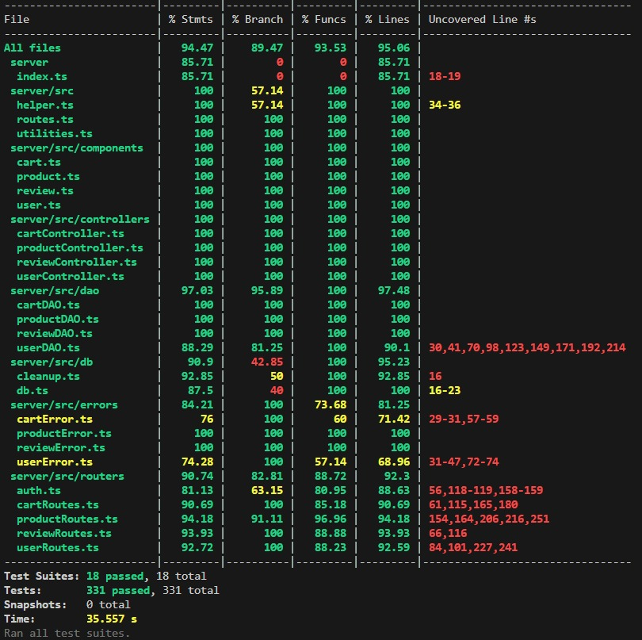

# Test Report

<The goal of this document is to explain how the application was tested, detailing how the test cases were defined and what they cover>

# Contents

- [Test Report](#test-report)
- [Contents](#contents)
- [Dependency graph](#dependency-graph)
- [Integration approach](#integration-approach)
- [Tests](#tests)
- [Coverage](#coverage)
  - [Coverage of FR](#coverage-of-fr)
  - [Coverage white box](#coverage-white-box)

# Dependency graph

# Integration approach

  The integration sequence adopted follows a bottom-up approach, starting from testing units with no outgoing dependencies. These units are tested in isolation using unit testing techniques. Once they are tested, they become 'trusted' units. Subsequently, other units with outgoing dependencies to the trusted units are integrated with them, and the partial aggregates are tested. The last step is a full integration, including API testing.

**Step 1: Unit Testing**
1. **Unit User**
   - Test in isolation using unit testing techniques.
2. **Unit Product**
   - Test in isolation using unit testing techniques.
3. **Unit Cart**
   - Test in isolation using unit testing techniques.
4. **Unit Review**
   - Test in isolation using unit testing techniques.

**Step 2: Partial Integration**
1. **Unit User + Authentication**
   - Integrate `User` and authentication and test their combined behavior (login, logout and session).

**Step 3: Incremental Integration**
1. **Unit User + Product**
   - Integrate `Product` with `User`. Test the system to verify that user with the role of admin or manager can add/update/delete products in the store.
2. **Unit User + Product + Cart**
   - Integrate `Cart` with `User` and `Product`. Test the system to verify that a user with the role of customer can add/delete specific products to the cart.
3. **Unit User + Product + Review**
   - Integrate `Review` with `User` and `Product`. Test the system to verify that a user with the role of customer can leave reviews for products they have purchased, and that a user with the role of admin or manager can delete reviews for a specific product or all reviews in general.

**Step 4: Full Integration and API testing**
1. **Unit User + Product + Cart + Review**
   - Integrate all units together and test the complete system.
   - Test the `route.ts` API endpoint to ensure all system operations work correctly through the API.

# Tests

<in the table below list the test cases defined For each test report the object tested, the test level (API, integration, unit) and the technique used to define the test case (BB/ eq partitioning, BB/ boundary, WB/ statement coverage, etc)> <split the table if needed>

| Test case name              | Object(s) tested | Test level | Technique used |
| :------------:              | :--------------: | :--------: | :------------: |
|       **1 - Unit Tests**    |                  |            |                |
|     **1.1 Cart Tests**      |                  |            |                |
|   **1.1.1 - API Level**     |                  |            |                |
| GET /carts - Success        |  CartRoutes.get  |   Unit     |WB/ statement coverage|
| POST /carts - Success       |  CartRoutes.post |   Unit     |WB/ statement coverage|
| POST /carts - Product not found|  CartRoutes.post |   Unit     |WB/ statement coverage|
| POST /carts - Product not available|  CartRoutes.post |   Unit     |WB/ statement coverage|
| PATCH /carts - success|  CartRoutes.patch |   Unit     |WB/ statement coverage|
| PATCH /carts - No cart|  CartRoutes.patch |   Unit     |WB/ statement coverage|
| PATCH /carts - Cart empty|  CartRoutes.patch |   Unit     |WB/ statement coverage|
| PATCH /carts - No stock|  CartRoutes.patch |   Unit     |WB/ statement coverage|
| PATCH /carts - Low Stock|  CartRoutes.patch |   Unit     |WB/ statement coverage|
| GET /carts/history - Success|  CartRoutes.get |   Unit     |WB/ statement coverage|
| DELETE /carts/products/:model - Success|  CartRoutes.delete |   Unit     |WB/ statement coverage|
| DELETE /carts/products/:model - Model not in cart|  CartRoutes.delete |   Unit     |WB/ statement coverage|
| DELETE /carts/products/:model - No unpaid cart|  CartRoutes.delete |   Unit     |WB/ statement coverage|
| DELETE /carts/products/:model - Model inexist|  CartRoutes.delete |   Unit     |WB/ statement coverage|
| DELETE /carts/current - Success|  CartRoutes.delete |   Unit     |WB/ statement coverage|
| DELETE /carts - Success|  CartRoutes.delete |   Unit     |WB/ statement coverage|
| GET /carts/all - Success|  CartRoutes.get |   Unit     |WB/ statement coverage|
|   **1.1.2 - Controller Level**      |                  |            |                |
| Add to Cart - Success  |CartController.addToCart| Unit  |WB/ statement coverage|
| Add to Cart - Product Sold  |CartController.addToCart| Unit  |WB/ statement coverage|
| Get Cart - Success  |CartController.getCart| Unit  |WB/ statement coverage|
| Checkout Cart - Success  |CartController.checkoutCart| Unit  |WB/ statement coverage|
| Checkout Cart - No cart found|CartController.checkoutCart| Unit  |WB/ statement coverage|
| Checkout Cart - Cart Empty|CartController.checkoutCart| Unit  |WB/ statement coverage|
| Cart History - Success|CartController.getCustomerCarts| Unit  |WB/ statement coverage|
| Remove product from cart - Success|CartController.removeProductFromCart| Unit  |WB/ statement coverage|
| Remove product from cart - No cart|CartController.removeProductFromCart| Unit  |WB/ statement coverage|
| Remove product from cart - Cart empty|CartController.removeProductFromCart| Unit  |WB/ statement coverage|
| Clear cart - Success|CartController.clearCart| Unit  |WB/ statement coverage|
| Clear cart - No cart|CartController.clearCart| Unit  |WB/ statement coverage|
| Delete all cart - Success|CartController.deleteAllCarts| Unit  |WB/ statement coverage|
| Get all cart - Success|CartController.getAllCarts| Unit  |WB/ statement coverage|
|   **1.1.3 - DAO Level**             |                  |            |                |
| Get Products in Cart - Success|CartDAO.getProductsInCart| Unit  |WB/ statement coverage|
| Get Products in Cart - Error|CartDAO.getProductsInCart| Unit  |WB/ statement coverage|
| Insert Products in Cart - Success|CartDAO.insertProductInCart| Unit  |WB/ statement coverage|
| Insert Products in Cart - Error|CartDAO.insertProductInCart| Unit  |WB/ statement coverage|
| Update Product in Cart - Success|CartDAO.updateProductInCart| Unit  |WB/ statement coverage|
| Update Product in Cart - Error|CartDAO.updateProductInCart| Unit  |WB/ statement coverage|
| Update Cart Total - Success|CartDAO.updateCartTotal| Unit  |WB/ statement coverage|
| Update Cart Total - Error|CartDAO.updateCartTotal| Unit  |WB/ statement coverage|
| Get Product in Cart - Success|CartDAO.getProductInCart| Unit  |WB/ statement coverage|
| Get Product in Cart - Empty|CartDAO.getProductInCart| Unit  |WB/ statement coverage|
| Get Product in Cart - Error|CartDAO.getProductInCart| Unit  |WB/ statement coverage|
| Delete Product in Cart - Success|CartDAO.deleteProductInCart| Unit  |WB/ statement coverage|
| Delete Product in Cart - Error|CartDAO.deleteProductInCart| Unit  |WB/ statement coverage|
| Delete Current Cart - Success|CartDAO.deleteCurrentCart| Unit  |WB/ statement coverage|
| Delete Current Cart - Error|CartDAO.deleteCurrentCart| Unit  |WB/ statement coverage|
| Get Current Cart ID - Success|CartDAO.getCurrentCartId| Unit  |WB/ statement coverage|
| Get Current Cart ID - Error|CartDAO.getCurrentCartId| Unit  |WB/ statement coverage|
| Get Current Cart ID - No Cart|CartDAO.getCurrentCartId| Unit  |WB/ statement coverage|
| Get Current Cart - Success|CartDAO.getCurrentCart| Unit  |WB/ statement coverage|
| Get Current Cart - New Cart|CartDAO.getCurrentCart| Unit  |WB/ statement coverage|
| Get Current Cart - Error|CartDAO.getCurrentCart| Unit  |WB/ statement coverage|
| Add To Cart - Success|CartDAO.addToCart| Unit  |WB/ statement coverage|
| Add To Cart - New Cart|CartDAO.addToCart| Unit  |WB/ statement coverage|
| Add To Cart - Error|CartDAO.addToCart| Unit  |WB/ statement coverage|
| Checkout Cart - Success|CartDAO.checkoutCart| Unit  |WB/ statement coverage|
| Checkout Cart - Error|CartDAO.checkoutCart| Unit  |WB/ statement coverage|
| Get Cart History - Success|CartDAO.getHistoryCarts| Unit  |WB/ statement coverage|
| Get Cart History - Error|CartDAO.getHistoryCarts| Unit  |WB/ statement coverage|
| Remove from Cart - Success|CartDAO.removeFromCart| Unit  |WB/ statement coverage|
| Remove from Cart - Product not in cart|CartDAO.removeFromCart| Unit  |WB/ statement coverage|
| Clear Cart - Success|CartDAO.clearCart| Unit  |WB/ statement coverage|
| Clear Cart - No Cart|CartDAO.clearCart| Unit  |WB/ statement coverage|
| Delete all Carts - Success|CartDAO.clearCart| Unit  |WB/ statement coverage|
| Delete all Carts - Error|CartDAO.clearCart| Unit  |WB/ statement coverage|
| Get all Carts - Success|CartDAO.clearCart| Unit  |WB/ statement coverage|
| Get all Carts - Error|CartDAO.clearCart| Unit  |WB/ statement coverage|
|     **1.2 - Product Tests**       |                  |            |                |
|   **1.2.1 - API Level**             |                  |            |                |
| POST /products - Success |ProductRoutes.post| Unit |WB/ statement coverage|
| POST /products - Product exists |ProductRoutes.post| Unit |WB/ statement coverage|
| POST /products - Future Date |ProductRoutes.post| Unit |WB/ statement coverage|
| PATCH /products/:model - Success |ProductRoutes.patch| Unit |WB/ statement coverage|
| PATCH /products/:model - Product not Found |ProductRoutes.patch| Unit |WB/ statement coverage|
| PATCH /products/:model - Future Date |ProductRoutes.patch| Unit |WB/ statement coverage|
| PATCH /products/:model/sell - Success|ProductRoutes.patch| Unit |WB/ statement coverage|
| PATCH /products/:model/sell - Product not Found|ProductRoutes.patch| Unit |WB/ statement coverage|
| PATCH /products/:model/sell - Future Date|ProductRoutes.patch| Unit |WB/ statement coverage|
| PATCH /products/:model/sell - Out of Stock|ProductRoutes.patch| Unit |WB/ statement coverage|
| PATCH /products/:model/sell - Low Stock|ProductRoutes.patch| Unit |WB/ statement coverage|
| GET /products - No constrains |ProductRoutes.get| Unit |WB/ statement coverage|
| GET /products - Model |ProductRoutes.get| Unit |WB/ statement coverage|
| GET /products - Category |ProductRoutes.get| Unit |WB/ statement coverage|
| GET /products - Invalid Query |ProductRoutes.get| Unit |WB/ statement coverage|
| GET /products - Product not found |ProductRoutes.get| Unit |WB/ statement coverage|
| GET /products/available - No constrains |ProductRoutes.get| Unit |WB/ statement coverage|
| GET /products/available - Model |ProductRoutes.get| Unit |WB/ statement coverage|
| GET /products/available - Category |ProductRoutes.get| Unit |WB/ statement coverage|
| GET /products/available - Invalid Query |ProductRoutes.get| Unit |WB/ statement coverage|
| GET /products/available - Product not found |ProductRoutes.get| Unit |WB/ statement coverage|
| DELETE /products/:model - Success |ProductRoutes.delete| Unit |WB/ statement coverage|
| DELETE /products/:model - Product not Found |ProductRoutes.delete| Unit |WB/ statement coverage|
| DELETE /products - Success |ProductRoutes.delete| Unit |WB/ statement coverage|
|   **1.2.2 - Controller Level**      |                  |            |                |
| Register Product - Success |ProductController.registerProduct| Unit |WB/ statement coverage|
| Register Product - No Date |ProductController.registerProduct| Unit |WB/ statement coverage|
| Register Product - Future Date |ProductController.registerProduct| Unit |WB/ statement coverage|
| Change Product Quantity - Success |ProductController.changeProductQuantity| Unit |WB/ statement coverage|
| Change Product Quantity - No Date |ProductController.changeProductQuantity| Unit |WB/ statement coverage|
| Change Product Quantity - Future Date |ProductController.changeProductQuantity| Unit |WB/ statement coverage|
| Change Product Quantity - Date Before Arrival |ProductController.changeProductQuantity| Unit |WB/ statement coverage|
| Sell Product - Success |ProductController.sellProduct| Unit |WB/ statement coverage|
| Sell Product - No Date |ProductController.sellProduct| Unit |WB/ statement coverage|
| Sell Product - Future Date |ProductController.sellProduct| Unit |WB/ statement coverage|
| Sell Product - Date Before Arrival |ProductController.sellProduct| Unit |WB/ statement coverage|
| Sell Product - Sold Out |ProductController.sellProduct| Unit |WB/ statement coverage|
| Sell Product - Low Stock |ProductController.sellProduct| Unit |WB/ statement coverage|
| Get Products - By Category |ProductController.getProducts| Unit |WB/ statement coverage|
| Get Products - By Model |ProductController.getProducts| Unit |WB/ statement coverage|
| Get Products - Unconstrained |ProductController.getProducts| Unit |WB/ statement coverage|
| Get Available Products - By Category |ProductController.getAvailableProducts| Unit |WB/ statement coverage|
| Get Available Products - By Model |ProductController.getAvailableProducts| Unit |WB/ statement coverage|
| Get Available Products - Unconstrained |ProductController.getAvailableProducts| Unit |WB/ statement coverage|
| Delete All Products - Success |ProductController.deleteAllProducts| Unit |WB/ statement coverage|
| Delete Product - Success |ProductController.deleteProduct| Unit |WB/ statement coverage|
|   **1.2.3 - DAO Level**             |                  |            |                |
| Create Product - Success |ProductDAO.createProduct| Unit |WB/ statement coverage|
| Create Product - Error |ProductDAO.createProduct| Unit |WB/ statement coverage|
| Update Product - Success |ProductDAO.updateProduct| Unit |WB/ statement coverage|
| Update Product - Product Not Found |ProductDAO.updateProduct| Unit |WB/ statement coverage|
| Update Product - Error |ProductDAO.updateProduct| Unit |WB/ statement coverage|
| Get Products - Success |ProductDAO.getProducts| Unit |WB/ statement coverage|
| Get Products - Product Not Found |ProductDAO.getProducts| Unit |WB/ statement coverage|
| Get Products - Error |ProductDAO.getProducts| Unit |WB/ statement coverage|
| Get Available Products - Success |ProductDAO.getAvailableProducts| Unit |WB/ statement coverage|
| Get Available Products - Product Not Found |ProductDAO.getAvailableProducts| Unit |WB/ statement coverage|
| Get Available Products - Error |ProductDAO.getAvailableProducts| Unit |WB/ statement coverage|
| Delete Product - Success |ProductDAO.deleteProduct| Unit |WB/ statement coverage|
| Delete Product - Error |ProductDAO.deleteProduct| Unit |WB/ statement coverage|
| Deleta All Products - Success |ProductDAO.deleteAll| Unit |WB/ statement coverage|
| Deleta All Products - Error |ProductDAO.deleteAll| Unit |WB/ statement coverage|
|     **1.3 - Review Tests**        |                  |            |                |
|   **1.3.1 - API Level**             |                  |            |                |
| POST /reviews/:model - Success |ReviewRoutes.post| Unit |WB/ statement coverage|
| POST /reviews/:model - Product Not Found |ReviewRoutes.post| Unit |WB/ statement coverage|
| POST /reviews/:model - Aready Reviewed |ReviewRoutes.post| Unit |WB/ statement coverage|
| GET /reviews/:model - Success |ReviewRoutes.get| Unit |WB/ statement coverage|
| DELETE /reviews/:model - Success |ReviewRoutes.delete| Unit |WB/ statement coverage|
| DELETE /reviews/:model - Product not found |ReviewRoutes.delete| Unit |WB/ statement coverage|
| DELETE /reviews/:model - No Review |ReviewRoutes.delete| Unit |WB/ statement coverage|
| DELETE /reviews/:model/all - Success |ReviewRoutes.delete| Unit |WB/ statement coverage|
| DELETE /reviews/:model/all - Product Not Found |ReviewRoutes.delete| Unit |WB/ statement coverage|
| DELETE /reviews/ - Success |ReviewRoutes.delete| Unit |WB/ statement coverage|
|   **1.3.2 - Controller Level**      |                  |            |                |
| Add Review - Success |ReviewController.addReview| Unit |WB/ statement coverage|
| Get Product Reviews - Success |ReviewController.getProductReviews| Unit |WB/ statement coverage|
| Delete Review - Success |ReviewController.deleteReview| Unit |WB/ statement coverage|
| Delete Reviews of Product - Success |ReviewController.deleteReviewsOfProduct| Unit |WB/ statement coverage|
| Delete All Reviews - Success |ReviewController.deleteAllReviews| Unit |WB/ statement coverage|
|   **1.3.3 - DAO Level**             |                  |            |                |
| Get Review for a Product - Success |ReviewDAO.getReviewForAProduct| Unit |WB/ statement coverage|
| Get Review for a Product - No Review |ReviewDAO.getReviewForAProduct| Unit |WB/ statement coverage|
| Get Review for a Product - Error |ReviewDAO.getReviewForAProduct| Unit |WB/ statement coverage|
| Create Review - Success |ReviewDAO.createReview| Unit |WB/ statement coverage|
| Create Review - Aready Exists |ReviewDAO.createReview| Unit |WB/ statement coverage|
| Get Reviews for a Product - Success |ReviewDAO.getReviewsForAProduct| Unit |WB/ statement coverage|
| Get Reviews for a Product - Error |ReviewDAO.getReviewsForAProduct| Unit |WB/ statement coverage|
| Delete Reviews - Success |ReviewDAO.deleteReviews| Unit |WB/ statement coverage|
| Delete Reviews - Error |ReviewDAO.deleteReviews| Unit |WB/ statement coverage|
| Delete User Review - Success |ReviewDAO.deleteUserReview| Unit |WB/ statement coverage|
| Delete User Review - Error |ReviewDAO.deleteUserReview| Unit |WB/ statement coverage|
| Delete All Reviews - Success |ReviewDAO.deleteAllReviews| Unit |WB/ statement coverage|
| Delete All Reviews - Error |ReviewDAO.deleteAllReviews| Unit |WB/ statement coverage|
|     **1.4 - User Tests**          |                  |            |                |
|   **1.4.1 - API Level**             |                  |            |                |
| POST /users - Success |UserRoutes.post| Unit |WB/ statement coverage|
| POST /users - User Already Exists |UserRoutes.post| Unit |WB/ statement coverage|
| GET /users - Success |UserRoutes.get| Unit |WB/ statement coverage|
| GET /users - Unauthorized |UserRoutes.get| Unit |WB/ statement coverage|
| GET /users/roles/:role - Success |UserRoutes.get| Unit |WB/ statement coverage|
| GET /users/roles/:role - Unauthorized |UserRoutes.get| Unit |WB/ statement coverage|
| GET /users/roles/:role - Invalid Role |UserRoutes.get| Unit |WB/ statement coverage|
| GET /users/:username - Success |UserRoutes.get| Unit |WB/ statement coverage|
| GET /users/:username - Unauthorized |UserRoutes.get| Unit |WB/ statement coverage|
| GET /users/:username - User does not exist |UserRoutes.get| Unit |WB/ statement coverage|
| DELETE /users/:username - Success |UserRoutes.delete| Unit |WB/ statement coverage|
| DELETE /users/:username - Not Admin |UserRoutes.delete| Unit |WB/ statement coverage|
| DELETE /users/:username - Admin Unauthorized |UserRoutes.delete| Unit |WB/ statement coverage|
| DELETE /users - Success |UserRoutes.delete| Unit |WB/ statement coverage|
| DELETE /users - Not Admin |UserRoutes.delete| Unit |WB/ statement coverage|
| DELETE /users - Admin Unauthorized |UserRoutes.delete| Unit |WB/ statement coverage|
| PATCH /users/:username - Success |UserRoutes.patch| Unit |WB/ statement coverage|
| PATCH /users/:username - Not Logged In |UserRoutes.patch| Unit |WB/ statement coverage|
| PATCH /users/:username - Wrong user |UserRoutes.patch| Unit |WB/ statement coverage|
| PATCH /users/:username - User doesn't exist |UserRoutes.patch| Unit |WB/ statement coverage|
| PATCH /users/:username - Invalid Birthdate |UserRoutes.patch| Unit |WB/ statement coverage|
|   **1.4.2 - Controller Level**      |                  |            |                |
| Create User - Success |UserController.createUser| Unit |WB/ statement coverage|
| Create User - User Already Exists |UserController.createUser| Unit |WB/ statement coverage|
| Get User by Username - Success |UserController.getUserByUsername| Unit |WB/ statement coverage|
| Get User by Username - User Not Found |UserController.getUserByUsername| Unit |WB/ statement coverage|
| Get User by Username - Error |UserController.getUserByUsername| Unit |WB/ statement coverage|
| Get Users - Success |UserController.getUsers| Unit |WB/ statement coverage|
| Get Users - Error |UserController.getUsers| Unit |WB/ statement coverage|
| Get Users by Role - Success |UserController.getUsersByRole| Unit |WB/ statement coverage|
| Get Users by Role - Error |UserController.getUsersByRole| Unit |WB/ statement coverage|
| Delete User - Success |UserController.deleteUser| Unit |WB/ statement coverage|
| Delete User - Error |UserController.deleteUser| Unit |WB/ statement coverage|
| Delete all Users - Success |UserController.deleteAll| Unit |WB/ statement coverage|
| Delete all Users - Error |UserController.deleteAll| Unit |WB/ statement coverage|
| Update User Info - Success |UserController.updateUserInfo| Unit |WB/ statement coverage|
| Update User Info - Error |UserController.updateUserInfo| Unit |WB/ statement coverage|
|   **1.4.3 - DAO Level**             |                  |            |                |
| Create User - Success |UserDAO.createUser| Unit |WB/ statement coverage|
| Get Users - Success |UserDAO.getUsers| Unit |WB/ statement coverage|
| Get Users by Role - Success |UserDAO.getUsersByRole| Unit |WB/ statement coverage|
| Get Users by Username - Success |UserDAO.getUserByUsername| Unit |WB/ statement coverage|
| Get Users by Username - Unauthorized |UserDAO.getUserByUsername| Unit |WB/ statement coverage|
| Delete User - Success |UserDAO.deleteUser| Unit |WB/ statement coverage|
| Delete User - Unauthorized |UserDAO.deleteUser| Unit |WB/ statement coverage|
| Delete User - Unauthorized Admin |UserDAO.deleteUser| Unit |WB/ statement coverage|
| Delete All Users - Success |UserDAO.deleteAll| Unit |WB/ statement coverage|
| Update User Info - Success |UserDAO.updateUserInfo| Unit |WB/ statement coverage|
| Update User Info - Unauthorized |UserDAO.updateUserInfo| Unit |WB/ statement coverage|
| Update User Info - Unauthorized Admin |UserDAO.updateUserInfo| Unit |WB/ statement coverage|
| Update User Info - Invalid Date |UserDAO.updateUserInfo| Unit |WB/ statement coverage|
|       **2 - Integration Tests** |                  |            |                |
|       **2.1 - Cart** |                  |            |                |
| GET /carts - Success        |  CartRoutes.get, CartController, CartDAO  |   Integration     |BB/ eq partitioning|
| GET /carts - Not a Customer  |  CartRoutes.get, CartController, CartDAO  |   Integration     |BB/ eq partitioning|
| POST /carts - Add new Product       |  CartRoutes.post, CartController, CartDAO |   Integration     |BB/ eq partitioning|
| POST /carts - Increase Quantity       |  CartRoutes.post, CartController, CartDAO |   Integration     |BB/ eq partitioning|
| POST /carts - "Model" is empty    |  CartRoutes.post, CartController, CartDAO |   Integration     |BB/ eq partitioning|
| POST /carts - Product not found|  CartRoutes.post, CartController, CartDAO |   Integration     |BB/ eq partitioning|
| POST /carts - Product not available|  CartRoutes.post, CartController, CartDAO |   Integration     |BB/ eq partitioning|
| PATCH /carts - Success|  CartRoutes.patch, CartController, CartDAO |   Integration     |BB/ eq partitioning|
| PATCH /carts - Not a Customer|  CartRoutes.patch, CartController, CartDAO |   Integration     |BB/ eq partitioning|
| PATCH /carts - No cart|  CartRoutes.patch, CartController, CartDAO |   Integration     |BB/ eq partitioning|
| PATCH /carts - Cart empty|  CartRoutes.patch, CartController, CartDAO |   Integration     |BB/ eq partitioning|
| PATCH /carts - No stock|  CartRoutes.patch, CartController, CartDAO |   Integration     |BB/ eq partitioning|
| PATCH /carts - Low Stock|  CartRoutes.patch, CartController, CartDAO |   Integration     |BB/ eq partitioning|
| GET /carts/history - Success|  CartRoutes.get, CartController, CartDAO |   Integration     |BB/ eq partitioning|
| GET /carts/history - Not a Customer|  CartRoutes.get, CartController, CartDAO |   Integration     |BB/ eq partitioning|
| DELETE /carts/products/:model - Decreases Quantity|  CartRoutes.delete, CartController, CartDAO |   Integration     |BB/ eq partitioning|
| DELETE /carts/products/:model - Remove Product|  CartRoutes.delete, CartController, CartDAO |   Integration     |BB/ eq partitioning|
| DELETE /carts/products/:model - Not a Customer|  CartRoutes.delete, CartController, CartDAO |   Integration     |BB/ eq partitioning|
| DELETE /carts/products/:model - Empty Cart|  CartRoutes.delete, CartController, CartDAO |   Integration     |BB/ eq partitioning|
| DELETE /carts/products/:model - Model not in cart|  CartRoutes.delete, CartController, CartDAO |   Integration     |BB/ eq partitioning|
| DELETE /carts/products/:model - Model inexist|  CartRoutes.delete, CartController, CartDAO |   Integration     |BB/ eq partitioning|
| DELETE /carts/products/:model - No unpaid cart|  CartRoutes.delete, CartController, CartDAO |   Integration     |BB/ eq partitioning|
| DELETE /carts/current - Success|  CartRoutes.delete, CartController, CartDAO |   Integration     |BB/ eq partitioning|
| DELETE /carts/current - Not a Customer|  CartRoutes.delete, CartController, CartDAO |   Integration     |BB/ eq partitioning|
| DELETE /carts/current - No unpaid cart|  CartRoutes.delete, CartController, CartDAO |   Integration     |BB/ eq partitioning|
| DELETE /carts - Success|  CartRoutes.delete, CartController, CartDAO |   Integration     |BB/ eq partitioning|
| DELETE /carts - Unauthorized|  CartRoutes.delete, CartController, CartDAO |   Integration     |BB/ eq partitioning|
| GET /carts/all - Success|  CartRoutes.get, CartController, CartDAO |   Integration     |BB/ eq partitioning|
| GET /carts/all - Unauthorized|  CartRoutes.get, CartController, CartDAO |   Integration     |BB/ eq partitioning|
|       **2.2 - Product** |                  |            |                |
| POST /products - Success Admin |ProductRoutes.post, ProductController, ProductDAO| Integration |BB/ eq partitioning|
| POST /products - Success Manager |ProductRoutes.post, ProductController, ProductDAO| Integration |BB/ eq partitioning|
| POST /products - Invalid Data |ProductRoutes.post, ProductController, ProductDAO| Integration |BB/ eq partitioning|
| POST /products - Unauthorized |ProductRoutes.post, ProductController, ProductDAO| Integration |BB/ eq partitioning|
| POST /products - Product exists |ProductRoutes.post, ProductController, ProductDAO| Integration |BB/ eq partitioning|
| POST /products - Future Date |ProductRoutes.post, ProductController, ProductDAO| Integration |BB/ eq partitioning|
| PATCH /products/:model - Success |ProductRoutes.patch, ProductController, ProductDAO| Integration |BB/ eq partitioning|
| PATCH /products/:model - Invalid Data |ProductRoutes.patch, ProductController, ProductDAO| Integration |BB/ eq partitioning|
| PATCH /products/:model - Unauthorized |ProductRoutes.patch, ProductController, ProductDAO| Integration |BB/ eq partitioning|
| PATCH /products/:model - Product not Found |ProductRoutes.patch, ProductController, ProductDAO| Integration |BB/ eq partitioning|
| PATCH /products/:model - Future Date |ProductRoutes.patch, ProductController, ProductDAO| Integration |BB/ eq partitioning|
| PATCH /products/:model - Date Before Arrival |ProductRoutes.patch, ProductController, ProductDAO| Integration |BB/ eq partitioning|
|PATCH /products/:model/sell - Success|ProductRoutes.patch, ProductController, ProductDAO| Integration |BB/ eq partitioning|
|PATCH /products/:model/sell - Invalid Data|ProductRoutes.patch, ProductController, ProductDAO| Integration |BB/ eq partitioning|
|PATCH /products/:model/sell - Unauthorized|ProductRoutes.patch, ProductController, ProductDAO| Integration |BB/ eq partitioning|
| PATCH /products/:model/sell - Product not Found|ProductRoutes.patch, ProductController, ProductDAO| Integration |BB/ eq partitioning|
| PATCH /products/:model/sell - Future Date|ProductRoutes.patch, ProductController, ProductDAO| Integration |BB/ eq partitioning|
| PATCH /products/:model/sell - Date Before Arrival|ProductRoutes.patch, ProductController, ProductDAO| Integration |BB/ eq partitioning|
| PATCH /products/:model/sell - Out of Stock|ProductRoutes.patch, ProductController, ProductDAO| Integration |BB/ eq partitioning|
| PATCH /products/:model/sell - Low Stock|ProductRoutes.patch, ProductController, ProductDAO| Integration |BB/ eq partitioning|
| GET /products - No constrains |ProductRoutes.get, ProductController, ProductDAO| Integration |BB/ eq partitioning|
| GET /products - Model |ProductRoutes.get, ProductController, ProductDAO| Integration |BB/ eq partitioning|
| GET /products - Category |ProductRoutes.get, ProductController, ProductDAO| Integration |BB/ eq partitioning|
| GET /products - Invalid Query |ProductRoutes.get, ProductController, ProductDAO| Integration |BB/ eq partitioning|
| GET /products - Product not found |ProductRoutes.get, ProductController, ProductDAO| Integration |BB/ eq partitioning|
| GET /products/available - No constrains |ProductRoutes.get, ProductController, ProductDAO| Integration |BB/ eq partitioning|
| GET /products/available - Model |ProductRoutes.get, ProductController, ProductDAO| Integration |BB/ eq partitioning|
| GET /products/available - Category |ProductRoutes.get, ProductController, ProductDAO| Integration |BB/ eq partitioning|
| GET /products/available - Invalid Query |ProductRoutes.get, ProductController, ProductDAO| Integration |BB/ eq partitioning|
| GET /products/available - Product not found |ProductRoutes.get, ProductController, ProductDAO| Integration |BB/ eq partitioning|
| DELETE /products/:model - Success |ProductRoutes.delete, ProductController, ProductDAO| Integration |BB/ eq partitioning|
| DELETE /products/:model - Unauthorized |ProductRoutes.delete, ProductController, ProductDAO| Integration |BB/ eq partitioning|
| DELETE /products/:model - Product not Found |ProductRoutes.delete, ProductController, ProductDAO| Integration |BB/ eq partitioning|
| DELETE /products - Success |ProductRoutes.delete, ProductController, ProductDAO| Integration |BB/ eq partitioning|
| DELETE /products - Unauthorized |ProductRoutes.delete, ProductController, ProductDAO| Integration |BB/ eq partitioning|
|       **2.3 - Review** |                  |            |                |
| POST /reviews/:model - Success |ReviewRoutes.post, ReviewController, ReviewDAO| Integration |BB/ eq partitioning|
| POST /reviews/:model - Invalid Data |ReviewRoutes.post, ReviewController, ReviewDAO| Integration |BB/ eq partitioning|
| POST /reviews/:model - Not a Customer |ReviewRoutes.post, ReviewController, ReviewDAO| Integration |BB/ eq partitioning|
| POST /reviews/:model - Product Not Found |ReviewRoutes.post, ReviewController, ReviewDAO| Integration |BB/ eq partitioning|
| POST /reviews/:model - Aready Reviewed |ReviewRoutes.post, ReviewController, ReviewDAO| Integration |BB/ eq partitioning|
| GET /reviews/:model - Success |ReviewRoutes.get, ReviewController, ReviewDAO| Integration |BB/ eq partitioning|
| GET /reviews/:model - Not Logged In |ReviewRoutes.get, ReviewController, ReviewDAO| Integration |BB/ eq partitioning|
| DELETE /reviews/:model - Success |ReviewRoutes.delete, ReviewController, ReviewDAO| Integration |BB/ eq partitioning|
| DELETE /reviews/:model - Not a Customer |ReviewRoutes.delete, ReviewController, ReviewDAO| Integration |BB/ eq partitioning|
| DELETE /reviews/:model - Product not found |ReviewRoutes.delete, ReviewController, ReviewDAO| Integration |BB/ eq partitioning|
| DELETE /reviews/:model - No Review |ReviewRoutes.delete, ReviewController, ReviewDAO| Integration |BB/ eq partitioning|
| DELETE /reviews/:model/all - Success |ReviewRoutes.delete, ReviewController, ReviewDAO| Integration |BB/ eq partitioning|
| DELETE /reviews/:model/all - Unauthorized |ReviewRoutes.delete, ReviewController, ReviewDAO| Integration |BB/ eq partitioning|
| DELETE /reviews/:model/all - Product Not Found |ReviewRoutes.delete, ReviewController, ReviewDAO| Integration |BB/ eq partitioning|
| DELETE /reviews/ - Success |ReviewRoutes.delete, ReviewController, ReviewDAO| Integration |BB/ eq partitioning|
| DELETE /reviews/ - Unauthorized |ReviewRoutes.delete, ReviewController, ReviewDAO| Integration |BB/ eq partitioning|
|       **2.4 - User** |                  |            |                |
| POST /users - Success |UserRoutes.post, UserController, UserDAO| Integration |BB/ eq partitioning|
| POST /users - Invalid Body |UserRoutes.post, UserController, UserDAO| Integration |BB/ eq partitioning|
| POST /users - User Already Exists |UserRoutes.post, UserController, UserDAO| Integration |BB/ eq partitioning|
| GET /users - Success |UserRoutes.get, UserController, UserDAO| Integration |BB/ eq partitioning|
| GET /users - Unauthorized |UserRoutes.get, UserController, UserDAO| Integration |BB/ eq partitioning|
| GET /users/roles/:role - Success |UserRoutes.get, UserController, UserDAO| Integration |BB/ eq partitioning|
| GET /users/roles/:role - Unauthorized |UserRoutes.get, UserController, UserDAO| Integration |BB/ eq partitioning|
| GET /users/roles/:role - Invalid Role |UserRoutes.get, UserController, UserDAO| Integration |BB/ eq partitioning|
| GET /users/:username - Success |UserRoutes.get| Integration |BB/ eq partitioning|
| GET /users/:username - Not Logged In |UserRoutes.get, UserController, UserDAO| Integration |BB/ eq partitioning|
| GET /users/:username - User does not exist |UserRoutes.get, UserController, UserDAO| Integration |BB/ eq partitioning|
| GET /users/:username - Unauthorized |UserRoutes.get, UserController, UserDAO| Integration |BB/ eq partitioning|
| DELETE /users/:username - Success |UserRoutes.delete, UserController, UserDAO| Integration |BB/ eq partitioning|
| DELETE /users/:username - Not Logged In |UserRoutes.delete, UserController, UserDAO| Integration |BB/ eq partitioning|
| DELETE /users/:username - User does not exist |UserRoutes.delete, UserController, UserDAO| Integration |BB/ eq partitioning|
| DELETE /users/:username - Not Admin |UserRoutes.delete, UserController, UserDAO| Integration |BB/ eq partitioning|
| DELETE /users/:username - Admin Unauthorized |UserRoutes.delete, UserController, UserDAO| Integration |BB/ eq partitioning|
| DELETE /users - Success |UserRoutes.delete, UserController, UserDAO| Integration |BB/ eq partitioning|
| DELETE /users - Not Admin |UserRoutes.delete, UserController, UserDAO| Integration |BB/ eq partitioning|
| PATCH /users/:username - Success |UserRoutes.patch, UserController, UserDAO| Integration |BB/ eq partitioning|
| PATCH /users/:username - Invalid Body |UserRoutes.patch, UserController, UserDAO| Integration |BB/ eq partitioning|
| PATCH /users/:username - Wrong user |UserRoutes.patch, UserController, UserDAO| Integration |BB/ eq partitioning|
| PATCH /users/:username - User doesn't exist |UserRoutes.patch, UserController, UserDAO| Integration |BB/ eq partitioning|
| PATCH /users/:username - Invalid Birthdate |UserRoutes.patch, UserController, UserDAO| Integration |BB/ eq partitioning|

# Coverage

## Coverage of FR

<Report in the following table the coverage of functional requirements and scenarios(from official requirements) >

| Functional Requirement or scenario | Test(s) |
| :--------------------------------: | :-----: |
| **FR1**                            |                       **Manage account**                       |
|  FR1.1                             |        Test : Integration Test POST /users                     |
|  FR1.2                             |                                                                |
|  FR1.3                             |                   Create a new user account                    |
| **FR2**                            |                        **Manage users**                        |
|  FR2.1                             |              Test : Integration Test   GET /users            |
|  FR2.2                             |        Test : Integration Test GET /users/roles/:role          |
|  FR2.3                             |           Test : Integration Test GET /users/:username         |
|  FR2.4                             |           Test : Integration Test PATCH /users/:username       |
|  FR2.5                             |            Test : Integration Test DELETE /users/:username     |
|  FR2.6                             |         Test : Integration Test DELETE /users                  |
| **FR3**                            |                      **Manage products**                       |
|  FR3.1                             |         Test : Integration Test POST /products                 |
|  FR3.2                             |        Test : Integration Test  PATCH /products/               |
|  FR3.3                             |     Test : Integration Test  PATCH /products/:model/sell       |
|  FR3.4                             |       Test : Integration Test  GET /products                   |
| FR3.4.1                            |           Test : Integration Test GET /products/available      |
|  FR3.5                             | Test : Integration Test  GET /products                         |
| FR3.5.1                            | Test : Integration Test  GET /products/available               |
|  FR3.5                             |     Test : Integration Test GET /products                      |
| FR3.5.1                            |  Test : Integration Test  PATCH /products/:model               |
|  FR3.7                             |    Test : Integration Test DELETE /products/:model             |
|  FR3.8                             |      Test : Integration Test  DELETE /products                 |
| **FR4**                            |                       **Manage reviews**                       |
|  FR4.1                             |            Test : Integration Test POST /reviews/:model        |
|  FR4.2                             |      Test : Integration Test GET /reviews/:model               |
|  FR4.3                             |              Test : Integration Test DELETE /reviews/:model    |
|  FR4.4                             |              Test : Integration Test  DELETE /reviews          |
|  FR4.5                             |      Test : Integration Test DELETE /reviews/:model/all        |
| **FR5**                            |                        **Manage carts**                        |
|  FR5.1                             |            Test : Integration TestGET /carts                   |
|  FR5.2                             |               Test : Integration Test POST /carts              |
|  FR5.3                             |                 Test : Integration Test  PATCH /carts          |
|  FR5.4                             |              Test : Integration Test GET /carts/history        |
|  FR5.5                             |      Test : Integration Test  DELETE /carts/products/:model    |
|  FR5.6                             |          Test : Integration Test  DELETE /carts/current        |
|  FR5.7                             |            Test : Integration Test GET /carts                  |
|  FR5.8                             |  Test : Integration Test  DELETE /carts       |

## Coverage white box

Report here the screenshot of coverage values obtained with jest-- coverage

